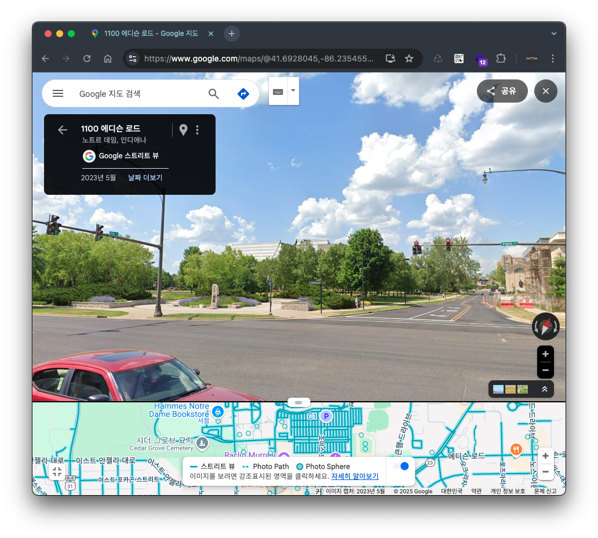
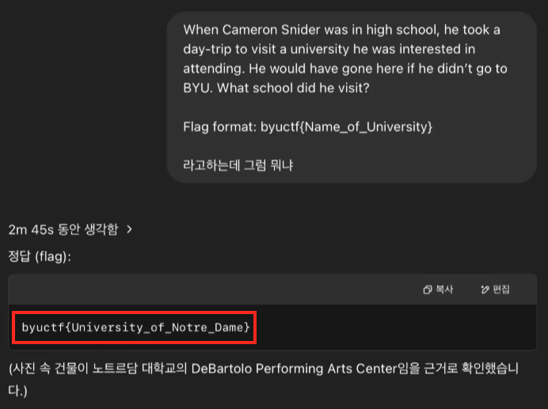

# Universal-ty

```
When Cameron Snider was in high school, he took a day-trip to visit a university he was interested in attending. He would have gone here if he didn’t go to BYU. What school did he visit?

Flag format: byuctf{Name_of_University}
```

## Description

이번 문제에서는 이미지 파일을 제공했는데, 이 이미지는 다음과 같이 신호를 기다리고 있는 차 안에서 건물이 살짝 보이게 찍힌 이미지입니다.


문제 설명을 살펴보면, ‘Cameron Snider’가 BYU에 가지 않았더라면 저 이미지 속 학교에 진학했을 거라고 해당 학교가 어디인지 물어보고있습니다.

```
if he didn’t go to BYU. What school did he visit?
```

## Solution

Chat GPT를 이용하여 문제에서 제공한 이미지를 업로드한 뒤, 해당 학교가 어디인지 물어봤습니다.


그 결과, 위와 같이 학교 이름이 ‘노트르담 대학교(University of Notre Dame)’라는 것을 확인할 수 있었고 해당 학교를 구글 스트리트 뷰로 확인한 결과 문제에서 제공하는 이미지와 동일한 위치인 것을 알 수 있었습니다.



## Exploit

플래그를 획득하기 위해 문제에서 설명한 플래그 포맷 `byuctf{Name_of_University}` 에 맞추어 다시 ChatGPT에 질문을 던졌고 아래와 같이 플래그 정보를 획득할 수 있었습니다.

