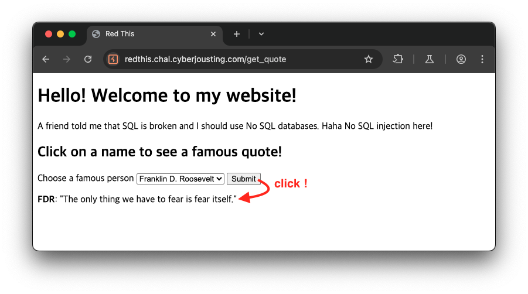
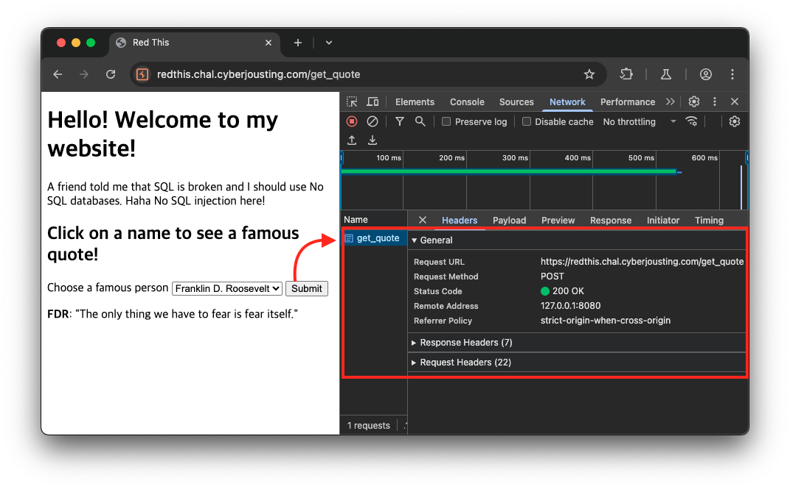
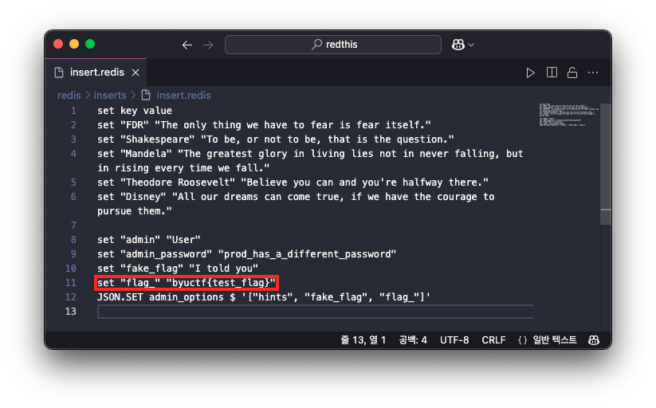
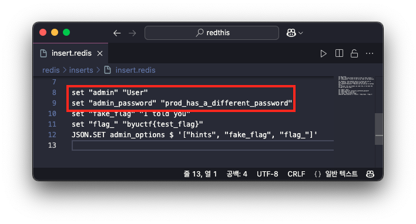
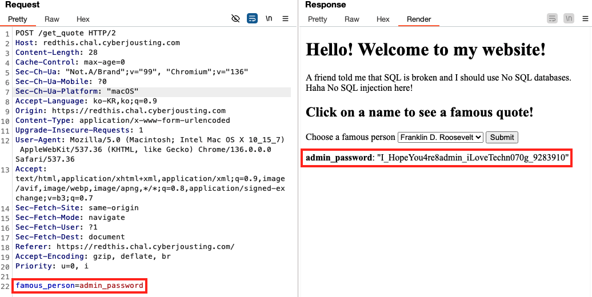
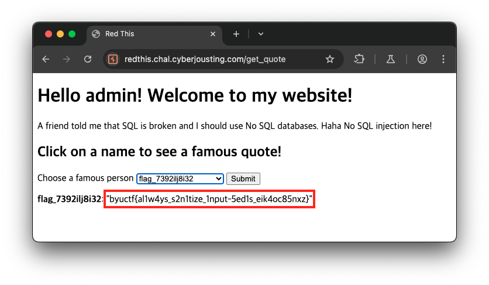

# Red This

```
https://redthis.chal.cyberjousting.com
```

## Description

이 문제는 설명 없이 링크 주소와 해당 문제의 파일들만 제공되었습니다.

링크를 통해 접속한 페이지는 문구를 통해  No SQL을 사용하고 있다고 얘기해주고 있으며, 아래와 같이 인물을 선택한 뒤 `Submit` 버튼을 클릭하면 해당 인물의 인용구 확인할 수 있는 페이지입니다.



`Submit` 버튼을 클릭 했을 때는 `POST` 메소드로 URL `/get_quote` 을 요청하는 것을 확인했습니다.



이후 처리되는 로직을 살펴보기 위해 제공된 파일들을 살펴보았는데, URL `/get_quote` 요청은 다음과 같이 처리되는 것을 확인할 수 있었습니다.

✅ `POST` `/get_quote` 엔드포인트 구현부

이 함수는 폼 데이터 `famous_person`에 `flag`가 포함되어 있고 세션 데이터의 `username`이 `admin`이 아닌 경우에는 `Nope`을 반환합니다. 그렇지 않은 경우에는 `getData` 함수에 `famous_person` 값을 전달하여 그 결과를 반환합니다.

```python
@app.route('/get_quote', methods=['POST'])
def getQuote():
    username = flask.session.get('username')
    person = flask.request.form.get('famous_person')
    quote = [person, '']
    if "flag" in person and username != "admin":
        quote[1] = "Nope"
    else: 
        quote[1] = getData(person)
    adminOptions = getAdminOptions(username)
    return flask.render_template('index.html', adminOptions=adminOptions, quote=quote)
```

이어서 `getData` 함수는 다음과 같이 구현되어 있습니다.

✅ `getData` 함수 구현부

이 함수는 Redis 데이터베이스에 저장된 값을 조회하기 위한 것으로, 인자로 전달된 `key` 의 값을 조회하는 함수입니다.

```python
def getData(key):
    db = redis.Redis(host=HOST, port=6379, decode_responses=True)
    value = db.get(key)
    return value
```

이후 문제에서 제공해준 파일들을 살펴봤는데, `insert.redis` 파일에서 초기에 저장되는 데이터 정보를 확인할 수 있었습니다. 그리고 다음과 같이 key 가 `flag_` 인 값에 플래그 정보가 담겨있는 것을 확인할 수 있었습니다.



따라서 Redis 데이터베이스에서 `flag_` 키를 조회하면 플래그 정보를 획득할 수 있습니다. 이를 위해 `getData` 함수의 인자로 `flag_` 를 전달해야 합니다. 하지만 앞서 살펴봤던대로, `/get_quote` URL에서 폼 데이터 `famous_person` 에 `flag` 라는 문자열이 포함되어 있고 세션의 `username` 이 `admin` 이 아닌 경우에는 `Nope` 이라는 응답만 반환됩니다. 그러므로 먼저 세션의 `username` 값을 `admin`으로 설정해야 합니다.

## Solution

세션에 담긴 `username` 의 값을 `admin` 으로 지정할 수 있는 방법은 `POST` 메소드로 요청되는 URL `/login` 엔드포인트에서 확인할 수 있었습니다.

✅ `/login` 엔드포인트 구현부

```python
@app.route('/login', methods=['POST', 'GET'])
def login():
     # return register page 
    if flask.request.method == 'GET':
        error = flask.request.args.get('error')
        return flask.render_template('login.html', error=error)
    
    username = flask.request.form.get("username").lower()
    password = flask.request.form.get("password")

    ## error check
    if not username or not password:
        return flask.redirect('/login?error=Missing+fields')
    
    # check username and password
    dbUser = getData(username)
    dbPassword = getData(username + "_password")
    
    if dbUser == "User" and dbPassword == password:
        flask.session['username'] = username
        return flask.redirect('/')
    return flask.redirect('/login?error=Bad+login')
```

위 코드에서 로그인 검증은 다음과 같은 과정을 검사하는 것을 확인할 수 있습니다.

1. 폼 데이터 `username` 과 `password` 를 전달 받는다.
    
    ```python
    username = flask.request.form.get("username").lower()
    password = flask.request.form.get("password")
    ```
    
2. `getData` 함수를 통해 Redis 데이터베이스에서 다음 두 데이터를 조회합니다.
    
    ```python
    # check username and password
    dbUser = getData(username)
    dbPassword = getData(username + "_password")
    
    if dbUser == "User" and dbPassword == password:
        flask.session['username'] = username
        return flask.redirect('/')
    
    ```
    
    - `username` 에 해당하는 키의 값이 `User` 인지 확인
    - `{username}_password` 키의 값이 전달받은 `password` 와 일치하는지 확인

위 내용을 통해 Redis 데이터베이스에 저장된 유저 정보(`username`, `password`)는 아래의 구조로 저장되는 것을 알 수 있습니다.

- `username` 이 admin 인 경우 패스워드의 `key` 이름은 `admin_password`
- `username` 이 test 인 경우 패스워드의 `key` 이름은 `test_password`

이후 사용자가 전달한 폼 데이터 `username` 의 값이 세션 내 `username` 의 값으로 전달되는 것을 확인할 수 있습니다.

```python
username = flask.request.form.get("username").lower()
# ... 생략 ...
flask.session['username'] = username
```

그럼 `username` 이 `admin` 일때, `admin_password` 의 값을 찾아야 하는데 앞서 살펴 봤던 `insert.redis` 를 보면 `admin_password` 의 값을 확인할 수 있었습니다. 단, 다음과 같이 문제 환경(`prod`)에서는 패스워드가 다르다고 나와있습니다.(처음 ‘prod_has_a_different_password’ 를 입력 했는데 ‘Bad Login’ 에러만 발생했습니다.)



이를 해결하기 위해 앞서 설명한 URL `/get_quote` 을 요청하는 방식으로 `admin_password` 의 값을 가져올 수 있습니다.

## Exploit

URL `/get_quote` 을 요청할 때 `famous_person` 의 값을 `admin_password` 로 지정하여 `admin_password` 의 값을 가져옵니다.



위 요청이 가능한 이유는 `/get_quote` 요청에서 `famous_person` 값에 `flag`가 포함되어 있지 않고, 세션의 `username`이 `admin`이 아닐 때만 `getData` 함수를 통해 Redis 데이터베이스의 특정 키를 조회할 수 있기 때문입니다.

```python
@app.route('/get_quote', methods=['POST'])
def getQuote():
    # ...생략...
    if "flag" in person and username != "admin":
        quote[1] = "Nope"
    else: 
        quote[1] = getData(person)
		# ...생략...
```

그 다음 획득한 `admin_password` 를 통해 로그인(`/login`)을 수행합니다.

- `username` admin
- `password` I_HopeYou4re8admin_iLoveTechn070g_9283910

이후 메인 페이지로 리다이렉션 되는데, 인물을 선택하는 폼에 다음과 같이 `flag_` 로 시작하는 옵션을 확인할 수 있었고, 해당 옵션을 선택하고 `Submit` 버튼을 클릭하면 다음과 같이 플래그 정보를 획득할 수 있었습니다.

