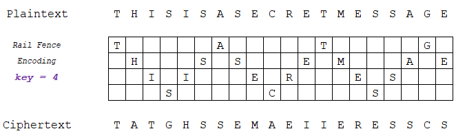

# Across the tracks

문제의 "railroad", "fence", "zig-zag"가 사용할 암호 scheme의 암시.

이에 필요한 depth는 "tenth track"으로 10이라고 암시.

# rail-fence 암호

사진과 같이 지그재그로 평문을 적고, 가로로 읽어서 암호문 추출.

복호화 할 때 depth가 key가 됨.

# 복호화 결과

`Some·ciphers·are·easier·to·solve.·Some·ciphers·are·harder·to·solve.·You·definitely·could·brute·force·this·one·if·you·did·it·by·hand.·I·had·to·do·that·recently·on·an·exam.·It·was·not·as·fun·as·I·had·hoped.·But·that·is·okay.·I·hope·you·didn't·do·this·by·hand.·Here·is·the·flag·tho:·bronco{r@1l_f3nc3_cip3rs_r_cool}`