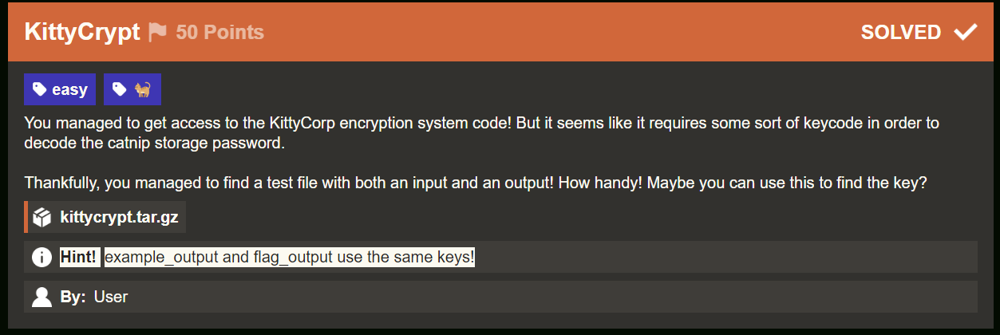

# KittyCrypt (50 Points)

key와 input의 길이가 같으면 output의 길이도 같은 구조이므로 example_output과 flag_ct가 같은 길이인 133바이트를 가지는 것을 알 수 있는 시점에서 example_input과 flag가 같은 키를 사용했다는 것을 짐작할 수 있음.

(이후 힌트가 추가됨)

1. example_input.txt와 example_output.txt의 차로 key 획득
2. flag_output.txt에 빼서 flag 획득