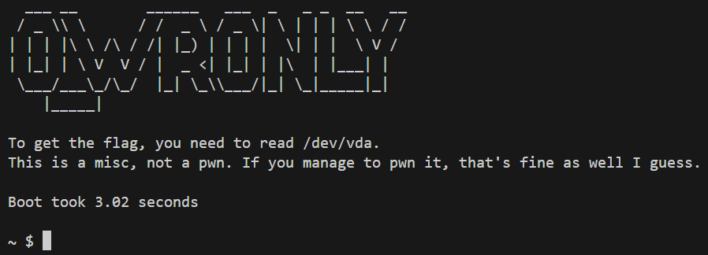

# O_WRONLY (321 Points)



문제를 실행시켜 보면, `/dev/vda` 파일을 읽어야 한다고 쓰여 있다.

`/dev/vda` 모듈의 소스코드는 `chal.c`를 통해 확인할 수 있다.

```c
struct kretprobe syscall_kprobe_open = {
	.handler = open_handler,
	.entry_handler = open_entry_handler,
	.data_size = sizeof(struct file_input),
	.maxactive = 20
};

static int ph_read_init(void) {
	syscall_kprobe_open.kp.symbol_name = "do_sys_openat2";
	register_kretprobe(&syscall_kprobe_open);

	return 0;
}
```

먼저 module init 부분을 보면, `syscall_kprobe_open` 을 통해 `do_sys_openat2()` 함수에 hook을 거는 것을 확인할 수 있다.

즉, `do_sys_openat2()` 함수에 진입하기 전 `open_entry_handler()`가 호출되고, `do_sys_openat2()` 함수가 리턴하기 전 `open_handler()`가 호출되는 것이다.

여기서 유의할 점은, `handler()` 함수는 `entry_handler()` 함수의 리턴값이 0인 경우에만 호출된다는 점이다.

```c
#define TARGET_FILE_NAME "vda"

static int open_entry_handler(struct kretprobe_instance *ri, struct pt_regs *regs) {
	struct file_input* input = (struct file_input*)ri->data;

	input->flags = ((struct open_how *)regs->dx)->flags;

	int len = strncpy_from_user(input->name, (char __user*)regs->si, 2000);
	if (unlikely(len <= 0)) {
		return 1;
	}

	int i;
	for (i = len; i > 0 && input->name[i] != '/'; i--);

	if (input->name[i] == '/')
		i++;

	if (i >= 2000)
		i = 0;

	if (strcmp(input->name + i, TARGET_FILE_NAME) == 0) {
		return 0;
	}

	return 1;
}
```

먼저 `open_entry_handler()` 함수를 보면, open 시 넘겨준 path인자가 `vda`로 끝난다면 0, 그렇지 않다면 1을 리턴한다.

```c
static struct file_operations phony_operations = {
	.read = phony_read,
	.write = phony_write,
	.llseek	= generic_file_llseek,
};

static struct file* get_cursed(int flags) {
	struct file* cursed = filp_open("/dev/null", flags, 0);
	cursed->f_op = &phony_operations;
	return cursed;
}

static int open_handler(struct kretprobe_instance *ri, struct pt_regs *regs) {
	struct file_input* input = (struct file_input*)ri->data;

	unsigned long fd;
    if (!is_syscall_success(regs)) {
		fd = get_unused_fd_flags(input->flags);
		regs_set_return_value(regs, fd);
    }
	

	if (is_syscall_success(regs)) {
		fd = regs_return_value(regs);

		struct fdtable *fdt;
		rcu_read_lock_sched();
		smp_rmb();
		fdt = rcu_dereference_sched(current->files->fdt);
		struct file* f = get_cursed(input->flags);
		rcu_assign_pointer(fdt->fd[fd], f);
		rcu_read_unlock_sched();
	}

	return 0;
}
```

`open_handler()` 함수를 보면, `do_sys_openat2()` 함수가 성공했는지에 여부와 관계없이, `get_cursed()` 함수를 통해 open한 `/dev/null` 파일을 fd값에 매핑하게 된다. 이를 통해 `/dev/vda`에 위치한 파일의 읽기를 시도하면 `phony_operations`에 등록된 함수가 대신 호출되게 된다.

이를 우회하기 위하여, `open_handler()` 함수가 호출되지 않음과 동시에 `/dev/vda`의 파일을 성공적으로 open해야 한다.

하지만 앞서 설명했듯, `open_handler()` 함수가 호출되지 않는다는 것은 `open_entry_handler()`의 리턴값은 1이어야 한다는 것, 즉, open의 인자로 마지막에 `vda`가 들어가지 않은 상태여야 한다는 뜻이다.

이는 symbolic link를 통해 해결할 수 있고, 그 결과는 아래와 같다.

