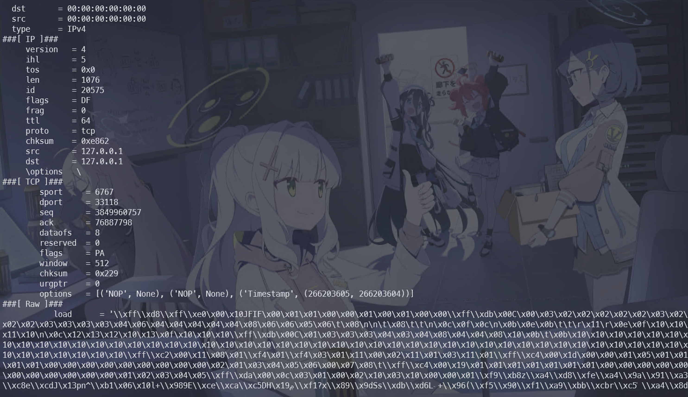

패킷들이 hex dump 형태로 주어진다.

```python
#!/usr/bin/env python3
# -*- coding: utf-8 -*-

from scapy.all import Ether, IP, TCP, Raw, wrpcap

def parse_hex_dump(lines):
    """
    lines: 헥스 덤프 문자열 리스트(한 줄 = 하나의 패킷)
    return: scapy 패킷 객체 리스트
    """
    packets = []
    for line in lines:
        # 공백이나 개행문자 제거
        line = line.strip()
        if not line:
            continue  # 빈 줄은 스킵
        
        # 헥스 문자열 -> 바이너리(바이트) 변환
        raw_data = bytes.fromhex(line)
        
        # Scapy Ether 클래스를 사용해 이더넷 레벨부터 파싱
        pkt = Ether(raw_data)
        packets.append(pkt)
        
    return packets

def main():
    # 예시: test.txt에 있는 헥스 덤프 한 줄씩 읽기
    with open("noshark.txt", "r") as f:
        lines = f.readlines()
    lines.pop(0)
    try:
        # 헥스 덤프 → scapy 패킷 객체로 변환
        packets = parse_hex_dump(lines)

        # 각 패킷에 대해 정보 출력 (예시)
        for i, pkt in enumerate(packets, start=1):
            print(f"[Packet {i}] ------------------------------")
            pkt.show()  # 상세 구조 출력 (Ether/IP/TCP 필드 등)

            # 필요 시, 특정 계층에 접근해 필드 값 추출 예시
            if IP in pkt:
                print("  [+] Source IP:", pkt[IP].src)
                print("  [+] Dest   IP:", pkt[IP].dst)
                if TCP in pkt:
                    print("  [+] Source Port:", pkt[TCP].sport)
                    print("  [+] Dest   Port:", pkt[TCP].dport)
            print()

    except:
        pass
        

if __name__ == "__main__":
    main()

```

위 코드로 hex dump를 분석해보면 아래와 같다.



`\xff\xd8`로 데이터가 시작하는 것으로 보아, jpeg 데이터로 추측되며, 해당 데이터를 extract 하면 된다.

```python
#!/usr/bin/env python3
# -*- coding: utf-8 -*-

from scapy.all import Ether, IP, TCP, Raw

def parse_hex_dump(lines):
    """
    lines: 헥스 덤프 문자열 리스트(한 줄 = 하나의 패킷)
    return: scapy 패킷 객체 리스트
    """
    packets = []
    for line in lines:
        # 공백이나 개행문자 제거
        line = line.strip()
        if not line:
            continue  # 빈 줄은 스킵
        
        # 헥스 문자열 -> 바이너리(바이트) 변환
        raw_data = bytes.fromhex(line)
        
        # Scapy Ether 클래스를 사용해 이더넷 레벨부터 파싱
        pkt = Ether(raw_data)
        packets.append(pkt)
        
    return packets

def main():
    # 1) test.txt에 있는 헥스 덤프 한 줄씩 읽기
    with open("noshark.txt", "r") as f:
        lines = f.readlines()
    lines.pop(0)
    # 2) 헥스 덤프 → scapy 패킷 객체로 변환
    packets = parse_hex_dump(lines)
    
    # 3) TCP 페이로드(Raw.load)를 모아 JPEG 파일로 저장
    jpg_data = b""
    for i, pkt in enumerate(packets, start=1):
        # 필요 시, 디버깅용으로 패킷 정보 출력
        # pkt.show()
        
        # IP / TCP 계층이 있고, Raw(페이로드)가 있으면 추출
        if IP in pkt and TCP in pkt and Raw in pkt:
            # Raw.load 는 bytes 타입이므로 그냥 이어붙이면 됨
            jpg_data += pkt[Raw].load

    # 4) 최종 데이터(이미지 바이트)를 output.jpg로 저장
    with open("output.jpg", "wb") as out_file:
        out_file.write(jpg_data)
    
    print(f"총 {len(packets)}개 패킷을 분석했고, 이미지 데이터를 'output.jpg'로 저장했습니다.")

if __name__ == "__main__":
    main()

```


