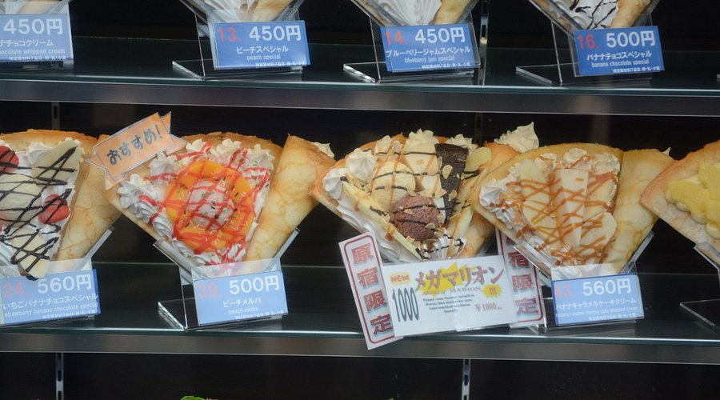
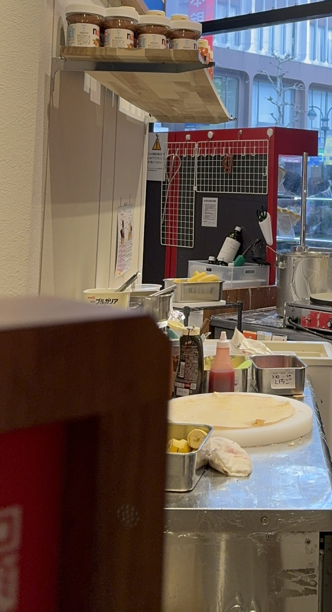

문제에 주어진 블로그에서 특정 맛집의 주소를 찾아내는 문제로 블로그에 주어진 이미지는 다음과 같다.
(다만, 첫번째 사진의 경우 문제 사이트가 닫혀 비슷한 이미지로 구해옴)

방법은 간단했다 구글 렌즈 혹은 구글 이미지 검색을 통해 첫번째 이미지를 검색해보면 `Marion Crepe` 라는 이름의 가게라는걸 알 수 있었다.

해당 가게는 체인점으로 정확한 위치를 특정해야했는데 문제 내용에 `Tokyo` 인근이라는 점과 [Marion Crepe](https://www.marion.co.jp/store/)사이트에 있는 지점 정보와

2번째 이미지의 가게 뒤 건물의 모양 등을 바탕으로 정확한 위치를 찾을 수 있었다.

[정답/구글맵](https://www.google.co.jp/maps/place/마리온+크레페+시부야+모디/@35.661303,139.7008213,3a,75y,90t/data=!3m8!1e2!3m6!1sAF1QipOB-BF1lOA_wueuG2ggM-9jprBp0Zt3BzYOtNEu!2e10!3e12!6shttps:%2F%2Flh5.googleusercontent.com%2Fp%2FAF1QipOB-BF1lOA_wueuG2ggM-9jprBp0Zt3BzYOtNEu%3Dw129-h86-k-no!7i5472!8i3648!4m7!3m6!1s0x60188dfb3cbdbf6f:0x7976c4f25c561e7e!8m2!3d35.6614009!4d139.7006695!10e5!16s%2Fg%2F11tx_tl0h3?entry=ttu&g_ep=EgoyMDI0MTIxMS4wIKXMDSoASAFQAw%3D%3D)