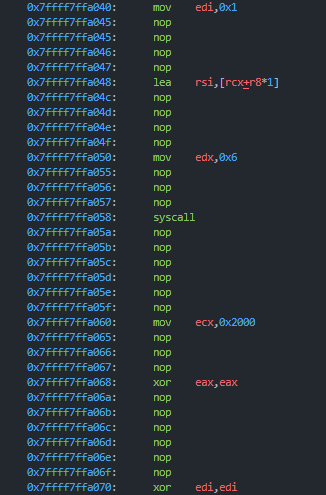
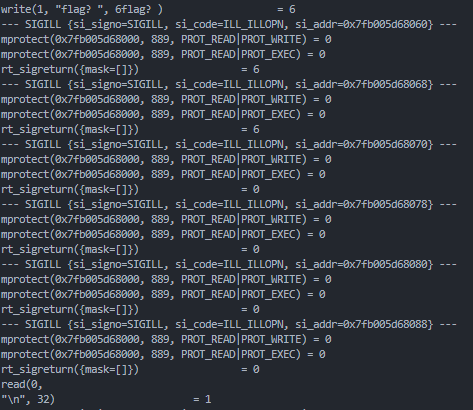

# Now this will run on my 486? (50 Points)

## 0x0 Overview

바이너리를 확인하면 main 내부에서 sigaction() 함수를 통해 SIGILL의 signal handler를 `sub_12C8`로 새로 지정한다. SIGILL는 Illegal Instruction을 감지했을 때 발생한다.
```c
v6.sa_flags = 4
v6.sa_handler = (__sighandler_t)sub_12C8
sigaction(4, &amp;v6, 0LL)
```
이후 특별한 입력 없이 특정 메모리에 권한을 부여하고 실행시킨다.

## 0x01 Analysis
실행시킨 영역의 데이터를 보면 x64 instruction set이 아니다. 따라서, SIGILL 인터럽트가 발생한다.
SIGILL이 발생하게 되면 signal handler로 지정한 함수인 `sub_12C8`가 실행되고 해당 코드에서는 인터럽트가 발생한 메모리부터의 8바이트를 복호화해준다.
복호화는 VM 처럼 되어 있어 이를 모두 해석하고 분석하기에는 매우 힘들다.

때문에 복호화된 instruction을 관찰하기 위해서는 복화를 진행한 후 관찰해야해서 gdb를 통해 이를 전부 확인할 수 있다.
rbp 값을 통해 현재 얼마나 복호화를 진행했는지 확인 가능하고 메모리는 다음 사진처럼 복호화 된다.



이렇게 복호화된 메모리를 계속 관찰하면서 현재 어떤 과정을 진행하고 있는지 리버싱해주면 된다.
strace 명령어를 활용하면 어떠한 syscall을 사용하게 shellcode에 대해 대략적으로 파악이 가능하다.



read까지 진행한 이후에는 다음 조건을 통해 문자열을 확인한다

```
1. 문자열의 길이가 0x1f인지 확인
2. 모든 문자의 합이 0xcff와 일치하는지 확인
3. 4바이트씩 xor 연산을 진행하고
4. 특정 값과 비교
5. 참이면 3번으로 이동
```

이이 조건을 모두 만족하면 correct 문자열이 출력되게 되어 있고 이는 직접 손으로 진행하였습니다.
`a ^ b = c`에서 b, c가 static으로 instruction에 박혀있기 때문에 쉽게 해결할 수 있습니다.

다음 조건을 확인하기 위해서는 무조건 앞선 조건을 만족해야하기 때문에 0x1f 길이의 문자의 합이 0xcff의 조건을 만족시키기 위해서 다음과 같이 입력값 생성기를 제작하여 사용하였습니다.

```python
def make_payload(buf):
    ans = bytearray(buf + b'\x01'*(0x1f-len(buf)))

    a = 0
    for i in range(0x1f):
        a += ans[i]

    a += 10
    idx = len(buf)
    
    while(a < 0xcff):
        if(ans[idx] < 0xff):
            b = ans[idx] + 1
            ans[idx] = b
            a += 1
        else:
            idx += 1

    c = 0
    for i in range(0x1f):
        c += ans[i]
    print(hex(c))
    return ans
```

Note. signal handler를 디버깅하기 위해서는 gdb에서 다음 옵션을 켜주어야 handler에 bp를 걸 수 있다.

```
handle SIGILL pass
handle SIGILL nostop
```

수동적으로 디버깅을 해주면 다음과 같이 플레그를 4글자씩 얻을 수 있습니다.

```python
two = b'{ftc'
three = b'_wow'
four = b'yrev'
five = b'tpo_'
six = b'lami'
seven = b'doc_'
eight = b'}!!e'
print(b'iris'+ two[::-1] + three[::-1] + four[::-1] + five[::-1] + six[::-1] + seven[::-1] + eight[::-1])
```

