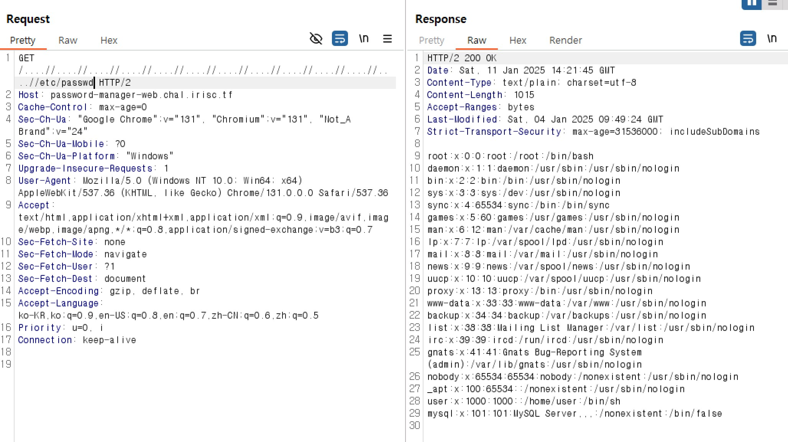
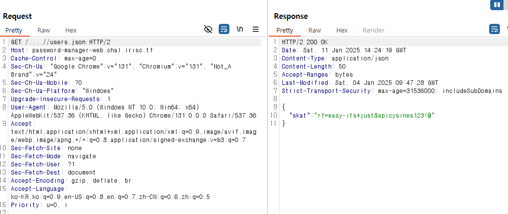
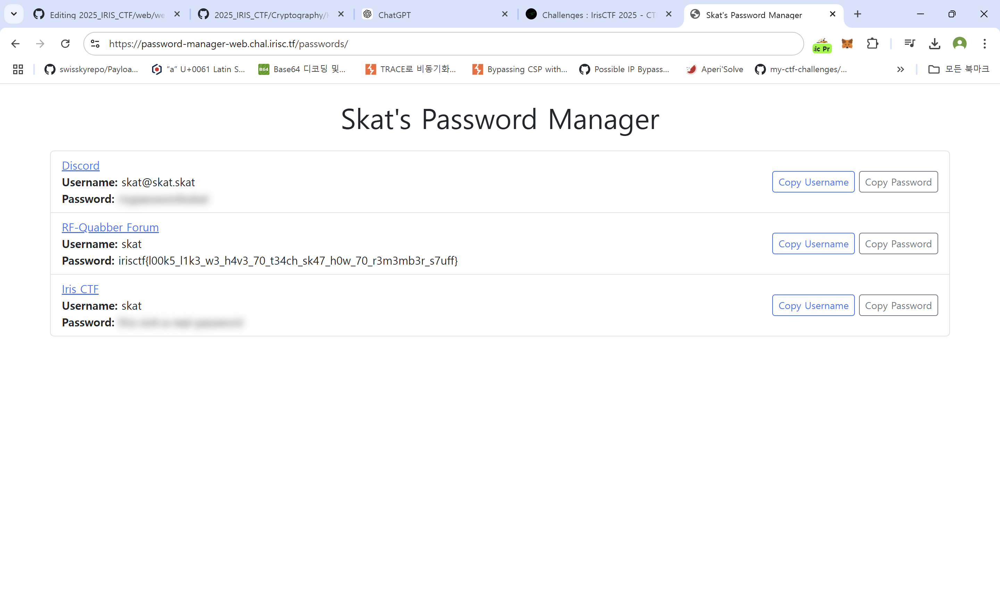

# Password manager (50 Points) - 357 Solved

go로 짜여진 간단한 password manager 기능을 가진 사이트이다.

먼저 소스코드는 main.go 하나밖에 없으며 취약점을 찾기 위해 자세히 보면 아래와 같은 부분을 발견할 수 있었다.

```
var PathReplacer = strings.NewReplacer(
	"../", "",
)

....

func pages(w http.ResponseWriter, r *http.Request) {
	// You. Shall. Not. Path traverse!
	path := PathReplacer.Replace(r.URL.Path)

	if path == "/" {
		homepage(w, r)
		return
	}

	if path == "/login" {
		login(w, r)
		return
	}

	if path == "/getpasswords" {
		getpasswords(w, r)
		return
	}

	fullPath := "./pages" + path

	if _, err := os.Stat(fullPath); os.IsNotExist(err) {
		notfound(w, r)
		return
	}

	http.ServeFile(w, r, fullPath)
}
```

../을 공백으로 치환함으로써 lfi를 막고 있는데 이는 ....//와 같은 문자를 사용함으로 써 우회가 가능하다.
아래 사진과 같이 LFI가 성공한 것을 확인할 수 있다.


그리고 코드를 살펴보면 user정보를 user.json에 담고있으므로 ....//user.json을 통해 skat의 계정 정보를 탈취할 수 있었다.


이후 skat의 아이디로 로그인 하면 Skat's Password manager 창에 접근할 수 있는데 여기서 skat의 password를 확인하면 flag임을 알 수 있다.


**FLAG** : `irisctf{l00k5_l1k3_w3_h4v3_70_t34ch_sk47_h0w_70_r3m3mb3r_s7uff}`
