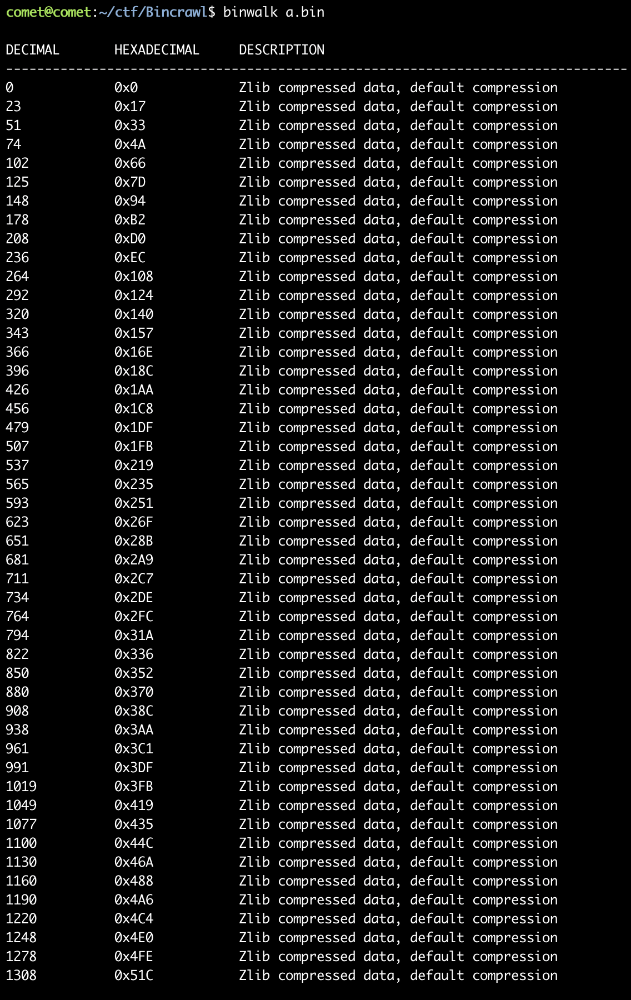

# Bincrawl

# Description

The first step in dealing with a bin file?

# Solve

주어진 파일을 binwalk로 돌려보면 첫번째 사진과 같이 zlib파일이 많이 나온다. binwalk의 -e 옵션으로 파일을 추출한 뒤 python으로 zlib 압축을 해체하는 코드를 짠다. 코드를 돌려보면 두번째 사진과 같이  플래그 포맷을 지킨 fake flag들이 있는데 그 중 가장 flag같은게 real flag이다.

flag:  `FMCTF{8Inw4lK_3x7R4c7_L2m4_4U70m47ic4lLy!!}`