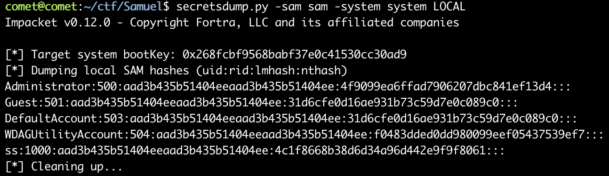

# Samuel Dummper

# Description

You know samuel?

FMCTF{Password}

# Solve

system파일과 sam파일이 주어진다. hex로 확인해보니까 windows관련된 파일인 것 같다. 플래그 포맷이 Password인걸 보면 password를 알아내야하는 것 같다. 일단 secretsdump.py라는 코드로 hashtable을 추출할 수 있다.

그 후 hashcat과 rockyou.txt를 이용하여 크래킹 할 수 있다.

flag: `FMCTF{babigurl1}`