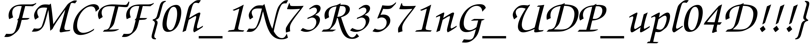

# UDP Upload

author : SafaSafari

i've uploaded png file through handwritten udp protocol can you recover that?

# 풀이

Wireshark가 Data 파트를 LLC(Logical-Link Control)로 잘못 파싱했는데, 우연히 N(R)=0으로 파싱된 패킷에 PNG 매직넘버, IHDR이 있는 걸로 보여서 패킷의 순서라는 생각을 할 수 있었다.

따라서 UDP 데이터 중 앞 4 bytes를 순서로 재배열하여 png를 구성하는 코드를 작성하였다.

# flag

