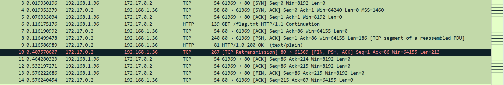
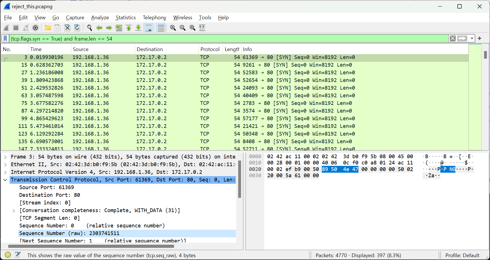
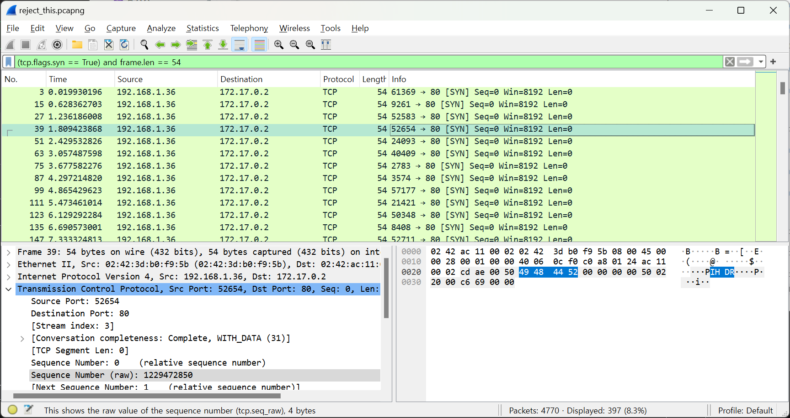

# reject_this

author : AliGhaffarian

Safa and I made a bet. If he doesn't catch me transmitting the flag, dinner's on him!

# ex.cpp

```bash
g++ -o ex ex.cpp -lpcap
```

# 풀이

총 12개의 TCP 패킷이 하나의 통신을 이루고 있다.



요약하면 192.168.1.36이 HTTP로 GET /flag.txt를 하면 172.17.0.2가 "that would be too easy :))" 하는 대화이다.

여기서 매 통신의 시작마다 raw_seq가 천차만별이라는 이상한 점을 깨달았어야 했다. 그래서 이를 유심히 살펴보기 위해 아래 필터를 걸면 PNG의 매직 넘버와 IHDR 등을 찾아 볼 수 있다.

`(tcp.flags.syn == True) and frame.len == 54`





# 회고

처음에는 192.168.1.36가 client인데 데이터를 전송하는게 맞는건가 하는 오해를 했는데, 문제에서 "플래그를 전송하고 있던걸 못알아채면" 이라고 했었던 것의 의미를 잘못 해석한 것이었다. 서버로부터의 leakage를 원하는게 아니라 비밀스럽게 플래그를 전달하고 싶다에 초점이 맞춰진 문제여서, 결과적으론 포렌식 태그가 맞다고 결론을 지었다.