# Anon Skiddie Part1

## Challenge

```
We have a new team member who is still in training. The other day, he said he is trying to learn Git in order to contribute to our writeup website but he is still struggling with it.

Let's hope he hasn't exposed his email address.

Flag example: FMCTF{s3an.4lpha3d0n@outlook.com}
```

## Write-Up
해당 문제를 번역 하면, ‘새로운 팀원이 writeup 웹 사이트에 기여하고자 Git을 배우려고 노력중이고, 그가 자신의 이메일을 노출하지 않았기를 바란다.’라고 나와있습니다.

플래그는 이메일 주소 형식으로 이루어져 있으므로 Git과 이메일을 생각했을 때, Git 커밋 기록에 남아 있는 커밋 작성자의 이메일 정보가 생각이 났습니다. 이는 `git log` 명령어를 입력했을 때, 다음과 같이 커밋 작성자의 이름과 이메일 정보를 확인할 수 있으므로, 이를 통해 커밋 기록에서 작성자의 이메일 정보를 획득 할 수 있을 것이라 판단했습니다.

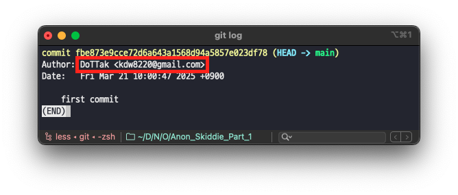

따라서, writeup 웹 사이트와 관련된 Git 저장소를 찾은 다음 `git log` 명령어를 입력하여 이메일 정보를 확인하기 위해 아래의 과정을 진행했습니다.

### 1️⃣ writeup 웹 사이트의 Git 저장소 발견

우선, 문제에서 얘기하는 writeup 웹 사이트의 Git 저장소를 찾기 위해 이번 `Nowruz 1404` CTF의 CTFTime 이벤트 페이지에 접속했습니다. 해당 페이지에서는 주최자 프로필 링크를 확인할 수 있었습니다.

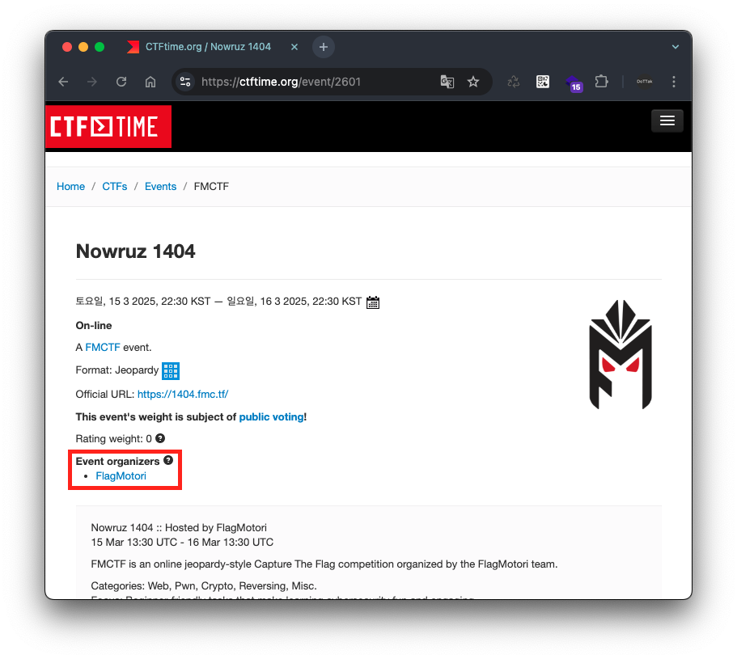

이후 해당 주최자의 프로필에 접속하면, 주최자의 웹 사이트 주소 `https://fmC.TF` 를 확인할 수 있습니다.

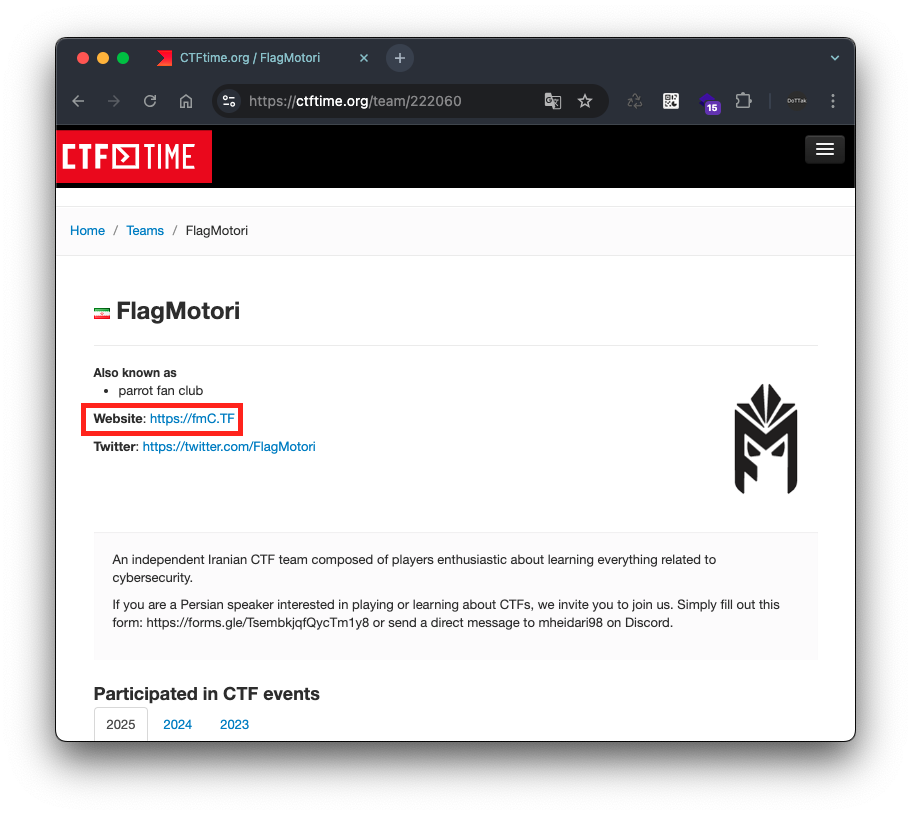

이어서 주최자의 웹 사이트를 접속하면, Github 링크를 확인할 수 있습니다.


이후 해당 Github에서는 다음과 같이 writeup 사이트 관련 저장소를 발견할 수 있었습니다.

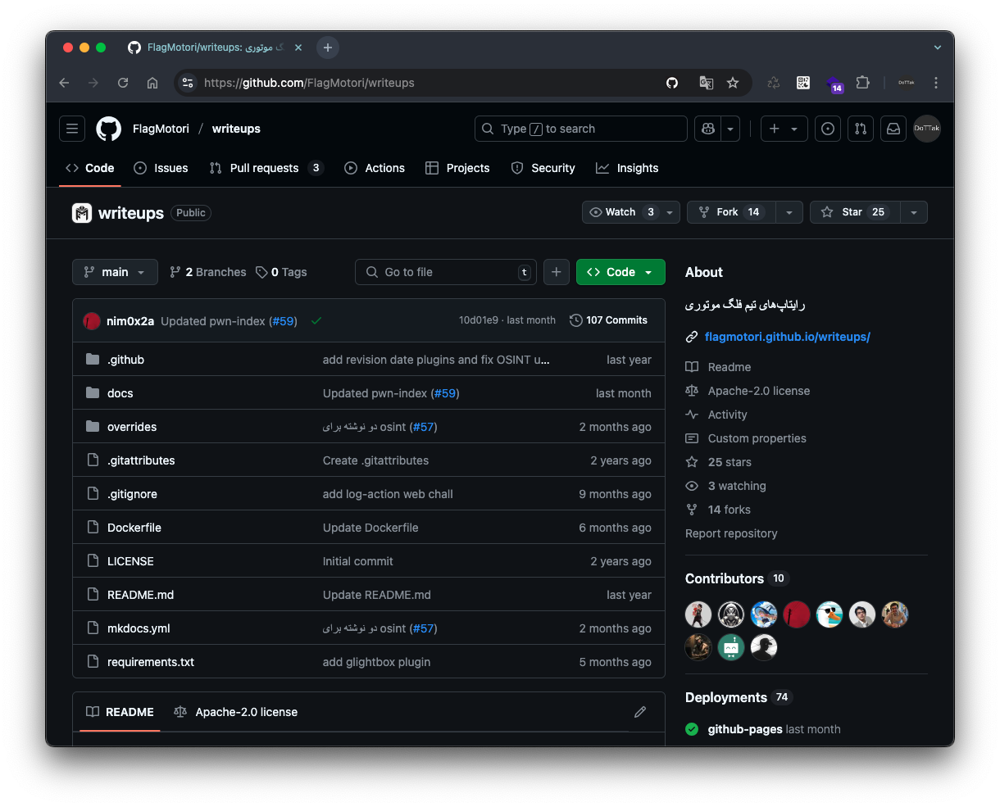

### 2️⃣ writeup 웹 사이트에 기여한 새로운 팀원 확인

writeup 웹 사이트의 Git 저장소를 확인했을 때, 가장 먼저 눈에 띈 내용은 PR 기록이 올라와 있던 내용이었습니다. 또한, 올라온 PR 기록을 살펴보니 `Leet Speak` 로 되어 있는 기록이 매우 의심이 됐습니다.(해당 PR의 타이틀 `7H15 15 my F1r57 k0mm17` 은 `This is my first commit` 로 해석됩니다.)

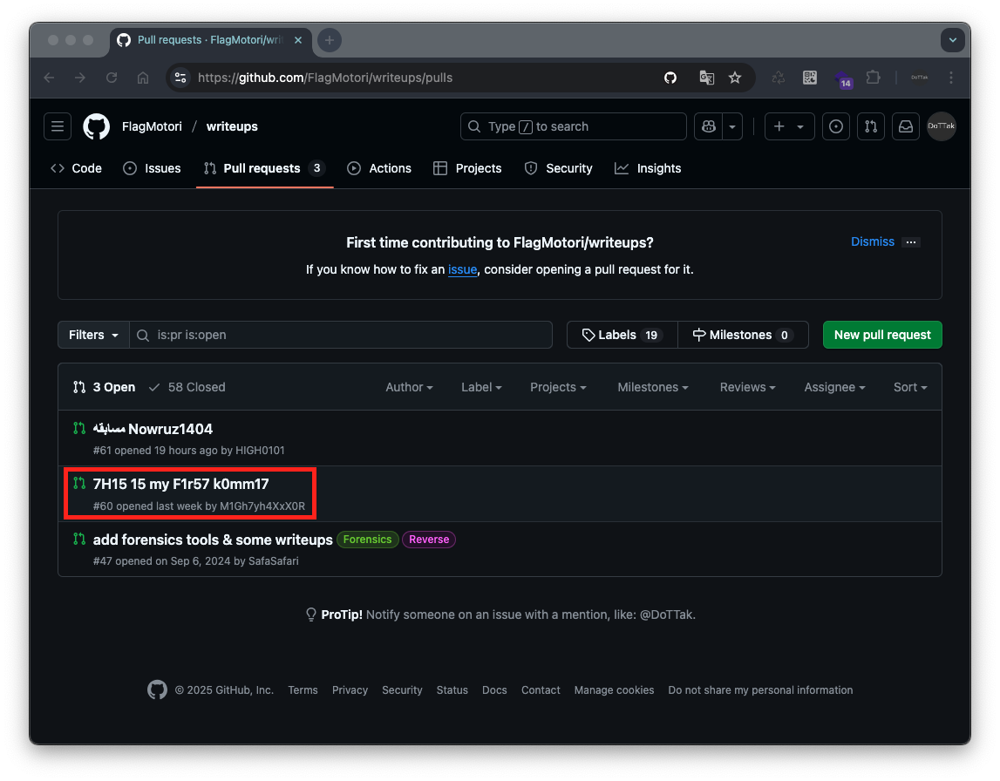

### 3️⃣ Git 저장소의 PR 작성자 정보 확인하기

올라온 PR 기록의 작성자 정보를 확인하기 위한 방법은 2가지가 있습니다.

첫 번째는 PR 브랜치를 로컬로 가져와서 확인하는 방법입니다. 이를 위해서는 다음의 과정을 수행합니다.

1. 해당 writeup 저장소를 로컬로 가져오기
    
    아래 명령어를 입력하면 writeup 저장소를 내려받을 수 있습니다.
    
    ```bash
    # git clone <저장소 주소>
    git clone https://github.com/FlagMotori/writeups.git
    ```
    
    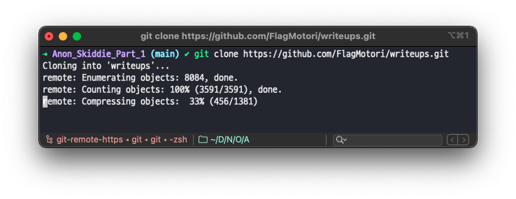
    
2. 대상 PR 번호를 확인하고 해당 PR을 내려받기
    
    PR 번호는 Git 저장소에서 대상 PR을 클릭하면 확인할 수 있습니다. 현재 내려받을 PR 번호는 다음과 같이 `60` 으로 나와있습니다.
    
    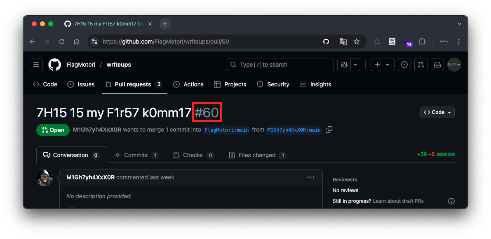
    
    이후 아래의 명령어를 입력하여 대상 PR(`#60`)을 브랜치로 내려받습니다.
    
    ```bash
    # git fetch origin pull/<PR번호>/head:<브랜치명>
    git fetch origin pull/60/head:PR-60
    ```
    
    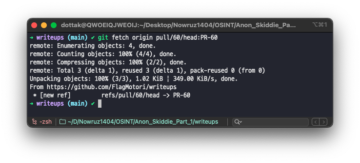
    
3. 내려받은 PR의 브랜치로 변경한 뒤 커밋 로그 기록 확인
    
    이후 다음의 명령어를 입력하여, 내려받은 PR의 브랜치로 변경하고 커밋 로그 기록을 확인합니다. 그럼 다음과 같이 커밋 작성자의 이메일 주소를 확인할 수 있습니다.
    
    ```bash
    # git checkout <브랜치명> # 브랜치로 checkout
    git checkout PR-60
    # git --no-pager log -n 1 # 커밋 기록 확인(--no-pager: 뷰어 없이, -n 1: 커밋 기록 1개)
    git --no-pager log -n 1
    ```
    
    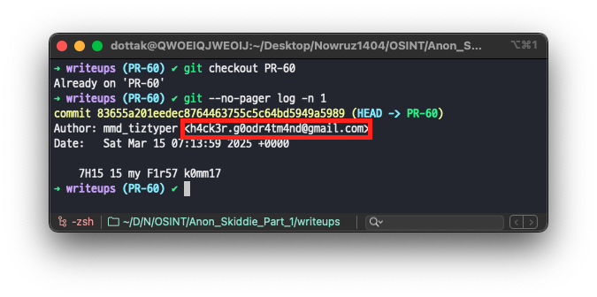
    

두 번째 방법은 PR이 올라온 사이트의 커밋 URL 주소 끝에 `.patch` 를 추가하는 방법입니다. 해당 과정은 다음과 같습니다.

1. Github에서 대상 PR의 커밋으로 이동
    
    확인할 PR로 접속한 뒤, `Commits` 탭으로 이동한 다음 대상 커밋의 번호를 클릭합니다.
    

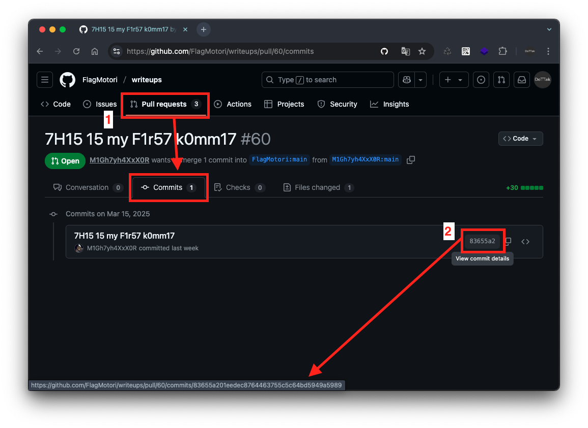

1. 대상 커밋의 URL 주소 끝에 `.patch` 를 추가합니다.
    
    리다이렉트된 커밋 URL 주소 끝에 다음과 같이 `.patch` 를 추가하여 접속하면 커밋 작성자의 정보를 확인할 수 있습니다.
    
    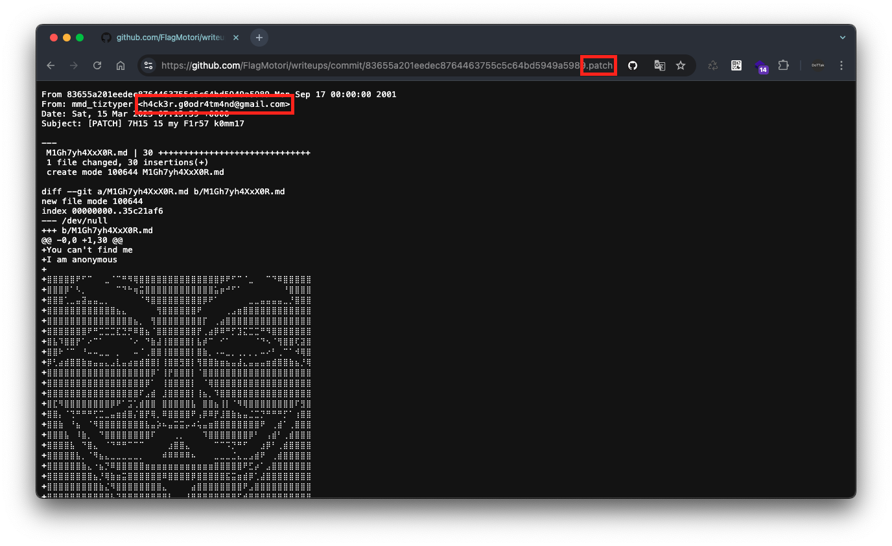
    

### 4️⃣ 플래그 확인

결과적으로, `Leet Speak` 으로 작성한 PR 타이틀 `7H15 15 my F1r57 k0mm17` 의 커밋 기록을 확인하였고, 여기서 발견한 이메일 주소 `h4ck3r.g0odr4tm4nd@gmail.com` 가 플래그임을 확인하였습니다.

이에 이번 문제의 플래그는 다음과 같습니다.

```
FMCTF{h4ck3r.g0odr4tm4nd@gmail.com}
```