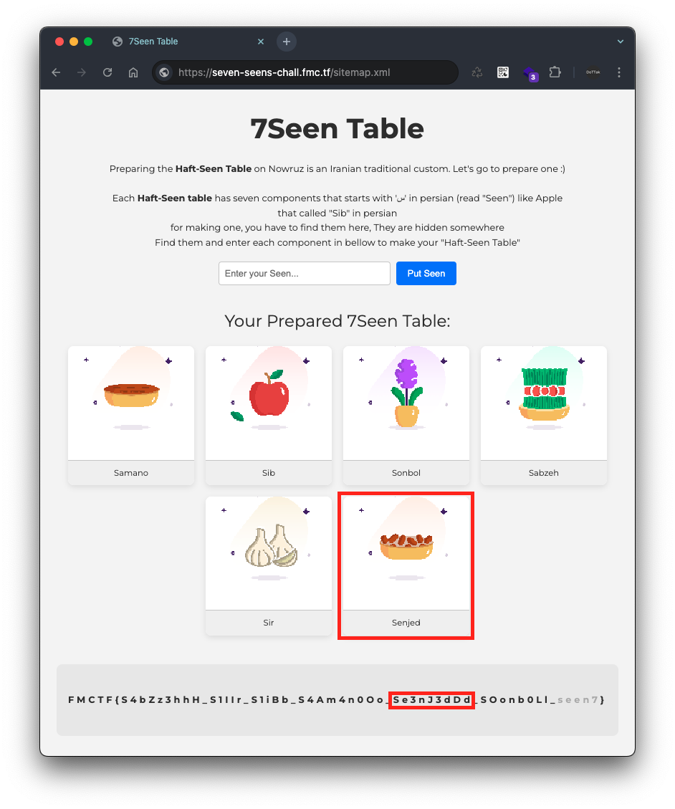

# 7seen

## Challenge

```
Can you find all the seens?
"the name of Iranian famous chracter starts with "Hajji" for the seen7"

https://seven-seens-chall.fmc.tf/
```

## Write-Up
주어진 문제의 URL 주소에 접속하면 `Haft-Seen Table` 을 만들기 위한 7가지 요소를 찾으라고 되어있으며, 각 요소들은 페르시아어 `س` 로 시작하는데, 어딘가에 숨겨져 있다고 나와있습니다. 


### 1️⃣ 첫 번째 Seen: `S4Am4n0Oo`

먼저, 페이지의 소스코드를 살펴봤는데, 코드 하단에 있는 주석에서 요소 `S4Am4n0Oo` 를 발견할 수 있었습니다.


이 요소를 페이지 중앙에 있는 입력 폼에 작성하고 `Put Seen` 버튼을 클릭하면, Seen 요소인 경우 하단의 플래그(`FMCTF{...}`)가 채워지게 됩니다.


### 2️⃣ 두 번째 Seen: `S1iBb`

두 번째 Seen도 첫 번째와 마찬가지로 소스코드에서 발견할 수 있었습니다. 입력 폼에 `data-value` 라는 속성의 값으로 `S1iBb` 가 적혀있는데, 이는 페이지 설명에 `Haft-Seen Table` 요소의 일부인 `Apple`(= `Sib`)이라는 것을 알 수 있었습니다.


### 3️⃣ 세 번째 Seen: `sonbol` 

세 번째 Seen 부터는 소스코드에서 발견되지 않아 시간이 좀 걸렸습니다. 이에 Seen을 입력할 때 나오는 이미지 파일명을 통해 먼저 `Haft-Seen Table` 요소들이 무엇이 있는지 확인했습니다.


이 방식은 Chat GPT를 통해 `Haft-Seen Table` 의 요소들이 무엇이 있는지를 확인하고,


이후 위 요소들이 있는지 이미지 URL 주소(e.g. `Sabzeh` → `/static/symbols/sabzeh.png`)를 요청해서 확인했습니다.


하지만 Seen 요소를 찾더라도 문자열이 `leet speak`로 변형되어 있어서(e.g. `Sib` → `S1iBb`) 정확한 문자열을 찾기가 어려웠습니다.

그러던 중 팀원 한 분이 HTTP Response Header에서 'Seen'이라는 헤더를 발견했는데, 이는 Base64로 인코딩된 문자열이었고, 디코딩해보니 Seen 요소임을 확인할 수 있었습니다.


- Base64 Encoding: `U09vbmIwTGw=`
- Base64 Decoding: `SOonb0Ll`


### 4️⃣ 네 번째 Seen: `S4bZz3hhH`

이어서 발견된 Seen도 팀원 한 분이 `robots.txt` 에서 발견했습니다. 이에 `robots.txt` 를 요청하면 다음과 같이 URL `/ohhh-ive-seen-a-seen` 을 발견할 수 있었습니다.


해당 URL `/ohhh-ive-seen-a-seen` 를 요청하면 다음과 같이 네 번째 Seen 요소인 `S4bZz3hhH` 를 발견할 수 있습니다.


### 5️⃣ 다섯 번째 Seen: `S1IIr`

다섯 번째 Seen도 팀원 분이 `sitemap.xml` 에서 발견했는데, 해당 파일의 내용은 다음과 같습니다.


이 파일에 적혀있는 `S1IIr` 을 입력 폼에 입력하고 `Put Seen` 버튼을 클릭하면 다섯 번째 Seen도 확인할 수 있었습니다.


추가로, `sitemap.xml` 에는 URL `/haft-seen` 를 발견할 수 있는데 해당 페이지를 요청해보겠습니다.

### 6️⃣ 여섯 번째 Seen: Se3nJ3dDd

앞서 살펴본 다섯 번째 Seen 요소를 발견한 과정에서 URL `/haft-seen` 를 발견할 수 있습니다.

이 URL을 요청하면 아래의 문구를 확인할 수 있는데, 해석하면 ‘오직 요청의 목적지가 `7seen` 인 경우에만 계속 진행할 수 있고, 현재 너의 `sec-fetch-dest` 가 `document` 라고 표시되고 있다고 합니다.

```
Only the request's destination to '7seen' can continue!, your sec-fetch-dest currently shows: document
```


위 문구에 적혀 있는 `sec-fetch-dest` 는 HTTP Request Header 이였고, 이 헤더의 값을 `7seen` 으로 변경하여 요청하면 다음의 HTTP Reponse를 확인할 수 있습니다.


위 응답 데이터의 Body 데이터는 해석하면 다음과 같습니다.

```
우리의 유명한 캐릭터의 ?name= 은 무엇인가요? 그 캐릭터는 노우루즈(새해) 즈음에 산타처럼 옵니다.
/^[a-z]{5} [a-z]{5}$/
```

즉, 캐릭터 이름을 URL 파라미터 `name` 에 ‘5글자 + 공백 + 5글자’로 작성 하라고 나와있는데, 이를 Chat GPT에 물어본 결과 `Hajji Firuz` 인 것을 알 수 있었습니다.


이에 `/haft-seen?name=Hajji Firuz` 를 요청하면 다음의 HTTP Response를 확인할 수 있으며, Body 내용을 살펴 보면, `AAAABQFYAXc=` 는 `'/xor-key'` 와 함께 암호화 되어 있다고 나와있습니다. 


이어서 URL로 보이는 `/xor-key` 를 요청하면 해당 페이지에서 `Se3nJ3dDd` 를 확인할 수 있었습니다.


그 결과, 여섯 번째 Seen 요소가 `Se3nJ3dDd` 임을 확인할 수 있습니다.



### 7️⃣ 일곱 번째 Seen: `Se3kKke3`

마지막 일곱 번째 Seen은 방금 전 여섯 번째 Seen(`Se3nJ3dDd`)을 찾는 과정에서 힌트를 얻을 수 있습니다.

1. URL `/haft-seen?name=Hajji Firuz` 를 요청했을 때, `AAAABQFYAXc=` 는 `/xor-key` 와 함께 암호화 되어 있다고 나와있었습니다.


1. URL `/xor-key` 를 요청하면 XOR 키가 `Se3nJ3dDd` 라고 나와있습니다.


따라서, XOR 키가 `Se3nJ3dDd` 이고, 암호화된 값이 `AAAABQFYAXc=` 이므로, 이를 다시 XOR을 수행하면 일곱 번째 Seen을 획득할 수 있습니다.

```python
import base64

if __name__ == "__main__":
    cipher_text = base64.b64decode("AAAABQFYAXc=")
    xor_key = "Se3nJ3dDd"

    result = ""
    for index, cipher_byte in enumerate(cipher_text):
        plain = chr(cipher_byte ^ ord(xor_key[index]))
        print(f"idx: {index}, cipher_byte: {cipher_byte}, xor: {xor_key[index]}({ord(xor_key[index])}), char: {plain}")
        result += plain
    
    print(f"Result: {result}")
```


위 복호화 스크립트 결과에 의해 일곱 번째 Seen은 `Se3kKke3` 인 것을 확인했습니다.


### ✅ 7Seen 정리

최종적으로, `Haft-Seen Table` 의 7개 요소들은 다음의 방법으로 찾을 수 있었습니다.

| No | Seen | Method |
| --- | --- | --- |
| 1 | `S4Am4n0Oo`  | 페이지 소스코드 하단 주석에서 발견됨 |
| 2 | `S1iBb` | 페이지 소스코드 입력 폼의 `data-value` 속성의 값에서 발견됨 |
| 3 | `sonbol` | HTTP Request Header 중 `Seen` 헤더의 값을 Base64 디코딩하면 발견됨 |
| 4 | `S4bZz3hhH` | `robots.txt` 에서 발견한 `/ohhh-ive-seen-a-seen` URL 요청하면 발견됨 |
| 5 | `S1IIr` | `sitemap.xml` 에서 발견됨 |
| 6 | `Se3nJ3dDd` | `sitemap.xml` 에 정의된 URL `/haft-seen` 을 요청한 뒤, `Sec-Fetch-Dest` 헤더에 `7seen` 을 작성하고, 다시 `/haft-seen?name=Hajji Firuz` 를 요청하면, `/xor-key` URL을 발견, 이 URL을 요청하면 발견됨 |
| 7 | `Se3kKke3` | 여섯 번째 Seen(`Se3nJ3dDd`)과 `/haft-seen` 을 요청했을 때 발견된 Base64 인코딩 문자열(`AAAABQFYAXc=`)과 XOR 수행하면 발견됨 |

그리고 7개의 Seen 요소들로 이루어진 플래그 값은 다음과 같습니다.

```
FMCTF{S4bZz3hhH_S1IIr_S1iBb_S4Am4n0Oo_Se3nJ3dDd_SOonb0Ll_Se3kKke3}
```