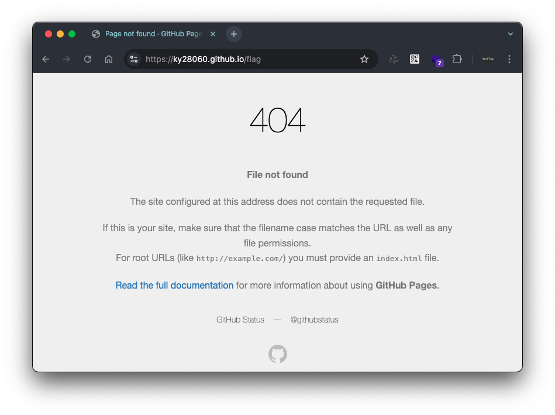
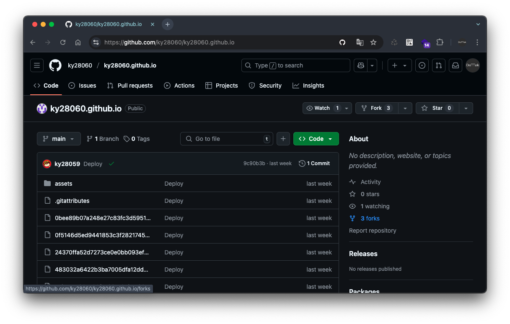
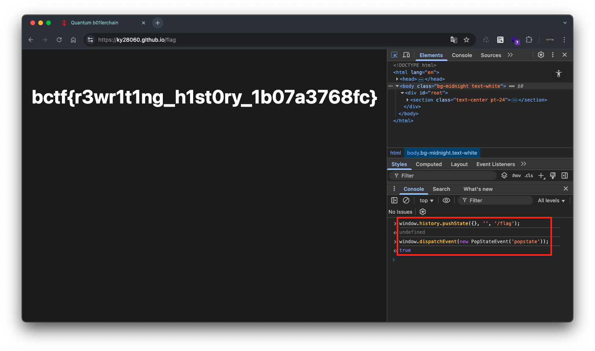

# trouble at the spa

```
I had this million-dollar app idea the other day, but I can't get my routing to work! I'm only using state-of-the-art tools and frameworks, so that can't be the problem... right? Can you navigate me to the endpoint of my dreams?
```

## Description

해당 문제는 React + TypeScript로 구성된 프로젝트로, 문제 설명을 보면 라우팅이 안된다고 힌트를 알려주고 있습니다.

> *but I can’t get my routing to work!
(하지만 라우팅이 작동하지 않네요)*
> 

올라온 문제 파일을 먼저 살펴 보겠습니다. 먼저, 웹 서비스 시작점인 `main.tsx` 를 살펴보면, URL `/falg` 경로로 `Flag.tsx` 의 `Flag` 컴포넌트를 참조하고 있습니다.

```tsx
import { StrictMode } from 'react';
import { createRoot } from 'react-dom/client';
import { BrowserRouter, Routes, Route } from 'react-router';

// Pages
import App from './App.tsx';
import Flag from './Flag.tsx';

import './index.css';

createRoot(document.getElementById('root')!).render(
    <StrictMode>
        <BrowserRouter>
            <Routes>
                <Route index element={<App />} />
                <Route path="/flag" element={<Flag />} />
            </Routes>
        </BrowserRouter>
    </StrictMode>
);
```

그 다음 `Flag` 컴포넌트가 정의된 `Flag.txs` 는 다음과 같이 정의되어 있습니다.

```tsx
export default function Flag() {
    return (
        <section className="text-center pt-24">
            <div className="flex items-center text-5xl font-bold justify-center">
                {'bctf{test_flag}'}
            </div>
        </section>
    )
}
```

이에 해당 문제의 URL 주소 https://ky28060.github.io/ 에서 URL `/flag` 를 요청했는데, 해당 페이지는 다음과 같이 404 Not Found 에러가 표시되고 있습니다.



이후 페이지 주소가 `github.io` 로 `github-pages` 를 사용하고 있다는 점을 확인하고, 저장소를 확인했으나 플래그와 관련된 내용은 발견할 수 없었는데,



React는 SPA(Single Page Application)로, 서버에서 리소스를 전달받아 렌더링하는 것이 아닌 웹 브라우저가 JavaScript 코드를 실행하여 렌더링하는 방식으로 동작합니다. 

따라서, `/flag` 경로로 접근을 시도할 때 서버(Git 저장소)에서는 해당 리소스를 찾을 수 없어 404 에러가 발생한 것으로 판단됩니다.

## Solution

아무튼 서버로 `/flag` 경로를 요청하지 않고 React 앱 즉, 클라이언트 측에서 `/flag` 경로에 대한 라우팅 처리를 수행해야하는데, 이는 다음의 코드를 이용하면 해결이 가능합니다.

- `window.history.pushState({}, '', '/flag');`
- `window.dispatchEvent(new PopStateEvent('popstate'));`

이 두 코드는 React Router를 직접 조작하여 URL을 변경하고 라우팅 이벤트를 발생시키는 역할을 합니다. 첫 번째 코드는 브라우저의 URL을 `/flag` 로 변경하고, 두 번째 코드는 URL 변경에 따른 라우팅 이벤트를 발생시켜 Flag 컴포넌트가 렌더링되도록 합니다.

따라서, 개발자 도구의 콘솔을 이용하여 아래 코드를 입력할 경우 다음과 같이 플래그 정보를 획득할 수 있습니다.

```jsx
window.history.pushState({}, '', '/flag');
window.dispatchEvent(new PopStateEvent('popstate'));
```

